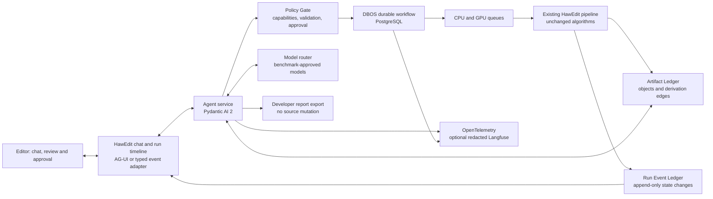
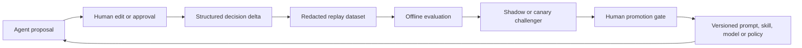

# HawEdit Agentic Architecture — Definitive Reality Check

**Date:** 11 August 2026  
**Status:** Architecture decision record and implementation brief  
**Supersedes:** `AGENT_ARCHITECTURE_RESEARCH_2026-08-11.md` where the conclusions differ

## Executive decision

HawEdit should not embed a general-purpose autonomous computer-use agent, a coding agent, or a society of cooperating agents. It should add a **single, typed creative-director agent** around the existing pipeline, backed by a durable workflow and an immutable account of every artifact and decision.

The best current production design for HawEdit is:

1. **Pydantic AI 2** for the agent loop, typed tools, model portability, structured decisions, evaluations, and human approval points.
2. **DBOS with PostgreSQL** for durable execution, queues, recovery, workflow state, and CPU/GPU worker routing on HawEdit's present Windows-first, predominantly single-host deployment.
3. A HawEdit-owned **Artifact Ledger and Run Event Ledger** in PostgreSQL as the authoritative memory of what exists, how it was produced, and what changed.
4. **AG-UI**, or a smaller compatible typed event stream if HawEdit's frontend cannot adopt AG-UI cleanly, for the chat, live timeline, approvals, and edit previews.
5. **OpenTelemetry** for tracing. Self-hosted Langfuse is optional for model/tool analytics, but it is not the workflow database or artifact source of truth.
6. A hard **Policy Gate** outside the model. The production agent receives only named HawEdit tools and cannot write source code, invoke an unrestricted shell, install packages, or silently publish an edit.
7. A **model router evaluated on HawEdit's own Sorani editorial benchmark**. No public benchmark can currently establish the best creative director for this application.

This is not a compromise architecture. It is the highest-quality design that fits the system HawEdit actually is today. Temporal is the stronger upgrade when HawEdit becomes a genuinely distributed, multi-host or high-availability service; installing it first would add operational weight before its advantages are needed.

## What the competing research got right—and wrong

| Claim | Verdict | Reality for HawEdit |
|---|---|---|
| Use a typed Python agent rather than a free-form desktop agent | **Correct** | Pydantic AI is the best fit because HawEdit is Python, has explicit domain objects, and must preserve its pipeline boundary. |
| DBOS is a better initial fit than Temporal | **Correct, with conditions** | DBOS is in-process, supports Windows/PowerShell, PostgreSQL, persisted queues and heterogeneous CPU/GPU workers. It fits HawEdit's current topology. Temporal remains the scale/HA migration path. |
| HawEdit has no resumability and probably restarts from zero | **Incorrect/outdated** | The current source already reuses ingest outputs, raw ASR results, transcript records, visual embedding windows, and completed delivery artifacts using digests and sidecars. What is missing is workflow-wide durable state and a uniform live event stream. |
| The researcher had no source access | **Incorrect for this review** | This review inspected the current repository at commit `88e29fb`. The design below is grounded in the code, not only prior prose. |
| OpenLineage/Marquez should be the agent's primary world model immediately | **Good idea, premature product choice** | An artifact/derivation graph is essential. A HawEdit-native ledger is the correct first implementation. OpenLineage models generic jobs/runs/datasets and would need extensive custom media facets while duplicating part of the DBOS operational view. Export to OpenLineage later if interoperability becomes valuable. |
| Claude hooks make a Pydantic AI runtime read-only | **Architecturally mixed** | Claude Agent SDK hooks are useful inside that SDK. They are not the enforcement layer for Pydantic AI. HawEdit must enforce capability limits in its tool service, database permissions, OS identity and egress policy. |
| Use a verifier during generation | **Correct after renaming** | Deterministic validators should reject invalid cuts, timing, provenance, policy violations, or unrenderable outputs before commit. This is constrained inference, not RLVR unless HawEdit is actually training with reinforcement learning. |
| A multi-agent crew is inherently better | **Rejected** | Current studies show that extra agents can consume more tokens without improving results. Use one accountable orchestrator. Optional independent, stateless review passes may be added only after an ablation demonstrates measurable improvement. |
| Do not fine-tune immediately | **Correct** | First collect approved edit deltas, reasons and outcomes; establish a held-out benchmark; improve prompts, context and tools; then test whether tuning adds value. |
| DPO needs at least exactly 1,000 pairs | **Unsupported universal threshold** | The cited small-model research is task-dependent and does not justify a magic production threshold. HawEdit should use learning curves and held-out performance, not a fixed number copied from another experiment. |
| Agent Skills should be used | **Correct with strict trust rules** | Skills are useful for editorial procedures and app knowledge. They are instructions, not a permission system. Only versioned, reviewed, internally signed skills should load in production. No automatic community-skill installation. |
| Antigravity is only a proprietary IDE and cannot be embedded | **Factually incorrect** | Google released an Antigravity Python SDK preview in May 2026. It is still a poor production core for HawEdit because it is preview software with coding-agent defaults, built-in shell/file powers and an opaque compiled runtime dependency. |
| Pi means Pydantic AI | **Incorrect naming** | These are distinct projects/concepts. This mistaken identification should not influence the architecture decision. |
| Langfuse should track the agent | **Correct, but limited** | Langfuse can observe model calls and tool traces. It must not become HawEdit's canonical workflow state, artifact history or editorial memory. |

## Evidence from the current HawEdit codebase

The repository already has several properties that materially change the orchestration decision:

- `run_pipeline` is a synchronous top-level pipeline and does not yet accept a progress/event sink. It is therefore easy to wrap, but cannot presently report every meaningful stage transition in real time.
- `PipelineRun` and related objects already provide explicit, serializable domain contracts. The agent should adapt these contracts; it should not replace the pipeline with agent-authored logic.
- Ingest reuse is protected by a source digest and command/output metadata.
- ASR reuse validates previous WSL request/output material and reruns invalid or truncated results.
- Transcript storage is keyed by the audio digest and producer identity.
- Visual embeddings are cached per window with source/model/revision identity and atomic staging.
- Delivery uses atomic sidecars and a final completion record, and can resume over an abandoned incomplete set.
- The prohibited forced-aligner packages are not installed; the local forced-alignment module uses HawEdit's own transcript word structures.
- The strongest current blocker to declaring a winning creative model is not framework technology. It is the absence of a sufficiently representative, labelled Sorani editorial benchmark and human decision set.

Consequently, a recovered DBOS workflow can safely re-enter a coarse HawEdit stage and let the pipeline's existing digest checks reuse completed work. HawEdit does not need to be broken into dozens of remote activities on day one.

## Target architecture



### Separation of responsibility

**The pipeline owns media truth.** It ingests, transcribes, aligns, analyses, proposes, renders and validates through existing deterministic functions.

**DBOS owns execution truth.** It records workflow identity, state, queues, recovery, retries and durable communications.

**The Artifact Ledger owns provenance truth.** It records which input, transcript, feature set, candidate, decision, render and delivery artifact derives from which parents and with which producer/configuration digests.

**The agent owns intent and editorial reasoning.** It translates the user's request into a constrained plan, invokes allowed tools, explains alternatives, requests approvals and revises proposals.

**The Policy Gate owns authority.** It decides which action is allowed and whether human approval is required. A model's promise to behave is never considered authorization.

**Observability owns diagnosis, not state.** OpenTelemetry/Langfuse answer why a call was slow, expensive or unsuccessful; they do not determine whether a render is completed or approved.

## Durable execution decision: DBOS now, Temporal on defined triggers

Pydantic AI officially supports DBOS, Temporal, Prefect and Restate through durability integrations. DBOS is the best first choice for HawEdit for concrete reasons:

- It runs as a Python library inside the application rather than requiring a separate workflow service before the first useful deployment.
- Its Python documentation explicitly supports Windows and PowerShell.
- It persists workflow state in PostgreSQL or SQLite; production HawEdit should use PostgreSQL.
- Persisted queues support concurrency limits, rate limits, priority and dedicated CPU/GPU workers.
- A restarted single server recovers pending workflows. This matches the current workstation/service topology.
- Pydantic AI model and MCP operations can be made durable through the official DBOS integration.

The implementation must respect several non-negotiable DBOS constraints:

- Keep workflow code deterministic; all external I/O belongs in durable steps.
- Custom HawEdit tool functions are not automatically durable merely because the agent is durable. Each I/O boundary must be explicitly wrapped.
- Pass small references and hashes across steps, never video, audio, frame arrays or large transcripts. DBOS serializes workflow arguments/results and documents an approximately 2 MB transaction-size limit.
- Model streaming at a workflow boundary may be buffered. Live product events should be written through an idempotent event handler into the Run Event Ledger, not inferred from token streaming.
- Workflow IDs, step names and application versions are public durable contracts. Deployments need version-aware recovery and a blue/green or explicit migration policy.

Move from DBOS to Temporal, or introduce Temporal for new distributed workflows, when one or more of these are true:

1. HawEdit schedules work across multiple independently deployed physical worker pools.
2. It becomes a multi-tenant hosted service with strict high-availability and isolation requirements.
3. Cross-region recovery, long retention and mature workflow-operations tooling become contractual requirements.
4. Workflow history and worker deployment lifecycles can no longer be managed safely by the application and its PostgreSQL deployment.
5. The team needs Temporal's operational ecosystem enough to justify the additional service and worker infrastructure.

DBOS Conductor can add production workflow management, recovery controls and visualization. It should be evaluated separately against HawEdit's hosting and data-residency requirements; the application must remain recoverable from its own PostgreSQL state rather than making an optional control plane its source of truth.

## The Artifact Ledger: the agent's actual world model

The strongest idea in the competing report is that the agent needs a graph of the media production process, not a pile of chat messages. The correction is to own that graph inside HawEdit first.

Minimum records:

```text
Artifact
  artifact_id, project_id, kind, content_digest, storage_ref
  producer, producer_version, config_digest, created_at, status

DerivationEdge
  parent_artifact_id, child_artifact_id, relation, metadata

RunEvent
  event_id, workflow_id, stage, state, timestamp
  artifact_id?, progress?, message?, error_code?, actor

EditorialDecision
  decision_id, candidate_id, action, reason_codes, free_text?
  model_id?, prompt_version?, user_id?, approved_at?

Approval
  subject_id, requested_action, requested_by, decided_by
  decision, scope, timestamp
```

Use explicit media-native kinds and relations: source video, normalized audio, transcript revision, word timing, scene/shot, speaker turn, semantic window, candidate clip, boundary revision, caption layout, render, QC report, delivery package; and `derived_from`, `aligned_to`, `supersedes`, `renders`, `validated_by`, `approved_as`.

The model receives a compact, permission-filtered projection of this graph plus the app manifest. It should never be given a directory dump and asked to discover state from filenames.

OpenLineage export can be added later. OpenLineage's generic Job/Run/Dataset model and custom facets are valuable for cross-system interchange, but Marquez is not required to build HawEdit's media-native world model and would add a second operational UI/database before there is an interoperability consumer.

## Agent knowledge and tools

The agent should know HawEdit through generated, versioned facts—not unlimited repository access.

At startup it receives an **App Manifest** containing:

- application build and schema versions;
- installed pipeline stages and capabilities;
- tool schemas and permission requirements;
- supported models and their promotion status;
- current project/artifact summary;
- policy version and blocked operations;
- relevant internally reviewed skills;
- current known limitations and benchmark status.

Recommended production tools:

- `inspect_project`
- `inspect_artifact`
- `explain_run_state`
- `start_pipeline`
- `cancel_or_pause_run`
- `resume_run`
- `list_candidates`
- `preview_candidate`
- `propose_boundary_revision`
- `propose_caption_revision`
- `compare_versions`
- `request_render`
- `run_quality_checks`
- `request_human_approval`
- `commit_approved_edit`
- `export_developer_report`

Every mutating tool must have a typed request, a typed result, an idempotency key, a project scope and an approval class. Tool implementations—not prompts—verify all of these.

Never expose to the production creative agent:

- arbitrary shell execution;
- general filesystem write access;
- package installation;
- source-code mutation;
- unrestricted web browsing or arbitrary MCP servers;
- direct publishing without a separate approval token.

If the agent finds an application defect, it creates a structured developer report with reproduction steps, workflow/artifact IDs, sanitized logs, expected versus actual behavior and the smallest suspected component. A separate coding agent or developer can fix it outside the production editor identity.

## One orchestrator, deterministic gates, optional review passes

HawEdit should begin with one Pydantic AI orchestrator. This provides a single accountable plan and avoids hidden negotiations among agents.

Quality gates should be deterministic where possible:

- media and transcript digests match;
- referenced words/scenes exist;
- cut boundaries are monotonic and within source duration;
- no required speaker/phrase is truncated;
- render configuration is supported;
- captions fit validated safe regions;
- delivery policy and user approval are satisfied;
- provenance is complete.

A second model call can review continuity, cultural nuance or hook strength, but it should be a stateless review pass over the same evidence—not an autonomous peer with separate memory and tools. It is promoted only if a controlled evaluation shows statistically and editorially meaningful improvement after accounting for extra latency and cost.

The available 2026 research is evidence against assuming that multi-agent systems are superior. It is not proof that they can never help. HawEdit should therefore use an ablation rule: **no additional agent role without a measured lift on the HawEdit benchmark**.

## Model strategy: do not confuse the newest model with the best editor

As of 11 August 2026, viable frontier candidates include:

- **GPT-5.6 Sol**, which offers a 1.05M-token context, structured outputs and tool calling, with image but not native audio/video input. Its high-reasoning/pro mode is a strong candidate for editorial planning from transcripts, features and selected keyframes.
- **Claude Fable 5**, Anthropic's strongest widely released current model, with long context, vision and tool use. Anthropic documents a 30-day retention period and states that Fable 5 is not available under Zero Data Retention; that is a material exclusion for confidential customer media unless the user's data policy explicitly permits it.
- **Gemini 3.6 Flash**, a stable multimodal model that accepts text, images, video and audio. Gemini 3.1 Pro is a higher-end preview candidate, but preview status must be included in the production risk decision. HawEdit's currently pinned Gemini 2.5 Pro judge should remain in place until a controlled promotion beats it.

No provider documentation or public benchmark tests the actual target: Sorani-language, culturally sensitive, content-aware clip selection and edit revision inside HawEdit. Therefore the honest answer to “which is absolutely best?” is a promotion test, not a brand name.

Use the same typed tool surface and evaluate candidate models on:

1. boundary quality and preservation of meaning;
2. Sorani comprehension and cultural appropriateness;
3. narrative coherence and hook strength;
4. grounded use of transcript, visual and speaker evidence;
5. instruction-following and edit controllability;
6. invalid-tool and policy violation rate;
7. consistency across reruns;
8. human preference, with latency and cost reported but not allowed to dominate quality.

Begin with the existing minimum 20-item regression gate only as a smoke test. A meaningful creative-model decision needs a broader, stratified set covering content genres, speakers, audio quality, code-switching, durations and failure cases. Preserve a held-out set that prompt authors and model providers never see.

Recommended initial challenger configuration:

- GPT-5.6 Sol high/pro reasoning as the text-and-keyframe creative director;
- the approved Gemini production model as multimodal judge/challenger;
- Gemini 3.1 Pro or 3.6 Flash in shadow evaluation according to stability and quality needs;
- Claude Fable 5 only for projects whose data classification permits its documented retention policy.

The router stores model, provider, reasoning level, prompt/skill versions and evidence digests with every decision so results remain reproducible.

## Safe improvement through use

“Self-improving” must mean controlled learning, not silent self-modification.

The production learning loop is:



Store structured deltas such as moved boundary, rejected candidate, caption correction, reason codes and final approval. Do not treat every user action as a preference: undo operations, experiments, accidental changes and policy-forced changes need distinct labels.

Improvement order:

1. Repair missing evidence or pipeline defects.
2. Improve tool schemas and deterministic validators.
3. Improve retrieval/context projection.
4. Revise prompts and internally reviewed skills.
5. Route to a better benchmarked model.
6. Only then evaluate supervised fine-tuning or preference optimization.

Fine-tuning is promoted only when learning curves on representative data show repeatable improvement on a locked held-out set without safety, grounding or generalization regression. There is no defensible universal threshold of 1,000 pairs.

## Security and privacy architecture

Prompt instructions and agent hooks are insufficient controls. Use layered enforcement:

1. The model sees only an allowlisted tool registry.
2. Tool handlers validate project scope, user role, schema, artifact state and idempotency.
3. Database roles separate read, proposal, approval and delivery powers.
4. Media storage uses scoped object references rather than filesystem paths where possible.
5. The agent service runs under an identity that cannot modify application source or install software.
6. External network access is provider/MCP allowlisted; retrieved text is untrusted data, never executable instructions.
7. Transcript, frame, face and voice data are redacted or disabled in telemetry by default.
8. Publishing, destructive replacement and policy overrides require explicit human approval tokens.
9. Skills and MCP/connectors are pinned, reviewed and auditable. A connector is not enabled merely because it exists.
10. A separate developer/coding identity handles source changes from exported reports.

This matters because public skill ecosystems have already demonstrated prompt-injection and malicious-skill risk. Skills can improve procedure recall; they must never grant authority.

## Chat and editorial experience

The user should see a creative-editor conversation, not workflow-engine terminology.

The interface needs four synchronized surfaces:

- **Conversation:** goals, explanations, alternatives and revision requests.
- **Run timeline:** ingest, transcription, analysis, candidate generation, QC, render and delivery, each backed by durable Run Events.
- **Evidence/preview:** transcript span, scene, speaker, keyframes, proposed cut and captions that support the current recommendation.
- **Approval/change set:** exactly what will change, what remains unchanged, expected output and whether the operation can be undone.

AG-UI is a good transport because it provides an open event protocol for streaming, shared state, tool events, custom events, cancellation and resume, and Pydantic AI has an official integration. Its security caveat is important: frontend-supplied history is caller-controlled. System policy and authoritative state must be reconstructed server-side.

The event hierarchy should be stable and replayable:

```text
run.created
stage.started
stage.progress
artifact.created
candidate.proposed
approval.requested
approval.decided
edit.committed
stage.completed | stage.failed | stage.paused
run.completed | run.failed | run.cancelled
```

The UI reconnects by workflow ID and last event ID, then replays the ledger. It does not depend on keeping one HTTP stream alive for a long render.

## Implementation path without restructuring HawEdit

### Phase 0 — benchmark and contracts

- Freeze the current pipeline behavior with regression cases.
- Define the App Manifest, tool schemas, policy classes, Artifact records and Run Events.
- Build the Sorani editorial evaluation set and model-promotion rubric.
- Add no autonomous writes.

### Phase 1 — durable observer wrapper

- Add a separate agent/orchestration package or service; do not move the existing algorithms.
- Wrap the current CLI/pipeline invocation as a coarse DBOS workflow and durable step.
- Introduce one additive `ProgressSink`/observer boundary in `run_pipeline`; existing callers receive a no-op default.
- Translate pipeline observations into append-only Run Events.
- Pass only project/artifact IDs and digests through DBOS.
- Verify crash/restart, duplicate request, cancellation and reconnect behavior.

At this stage, a crash may re-enter the coarse pipeline step, but HawEdit's existing caches and sidecars avoid redoing most completed work.

### Phase 2 — read-only creative director

- Add Pydantic AI with inspection, explanation and candidate-comparison tools.
- Load the versioned App Manifest and reviewed editorial skills.
- Add the benchmarked model router.
- Make all proposals non-mutating.

### Phase 3 — preview and approval

- Add typed proposal tools for boundaries, captions and render variants.
- Run deterministic validators before displaying an approval request.
- Commit only an explicitly approved change set.
- Add AG-UI or the thin typed adapter to HawEdit's frontend.

### Phase 4 — safe learning loop

- Record structured decision deltas and reason codes.
- Add offline replay, shadow challengers and canary promotion.
- Add optional stateless reviewer calls only if ablations prove value.
- Do not tune until the held-out evaluation demonstrates that data quantity and quality are sufficient.

### Phase 5 — scale only when triggered

- Split coarse pipeline work into durable activities only at proven safe/idempotent boundaries.
- Introduce dedicated worker services and HA control only when load requires them.
- Evaluate Temporal migration and OpenLineage export against actual cross-host and interoperability needs.

## Acceptance gates

The agentic upgrade is not production-ready until all of these pass:

- A process can be killed during every major stage and the run recovers without corrupting or silently duplicating output.
- Duplicate user submissions produce one logical workflow and idempotent effects.
- UI reconnect replays authoritative state after network loss.
- The agent cannot call an undeclared tool or cross a project boundary.
- Prompt injection inside transcript, metadata, web retrieval, a skill or an MCP response cannot grant new permissions.
- No source-code or unrestricted filesystem mutation is possible from the production agent identity.
- Every delivered clip traces to source, transcript/features, proposal, validators and human approval.
- A human can see and approve the exact edit delta before commit or delivery.
- Sensitive media/transcript content is absent from telemetry unless a project policy explicitly enables it.
- A candidate model beats the incumbent on a held-out HawEdit benchmark and does not regress policy adherence or tool validity.
- A rollback restores the previous model, prompt, skill, policy and workflow version.

## Final ranking

### 1. Pydantic AI 2 + DBOS/PostgreSQL + HawEdit Artifact Ledger + AG-UI

**Use now.** It best matches HawEdit's Python code, Windows-first single-host deployment, existing internal resumability, need for provider portability and requirement not to restructure the app. Its limitations are manageable when HawEdit passes references rather than media payloads and writes live events idempotently.

### 2. Pydantic AI 2 + Temporal + the same Ledger/UI design

**Use when distributed scale or HA triggers appear.** It provides the more mature dedicated durable-workflow control plane, but its service/worker operational footprint is unnecessary for the first agentic release.

### 3. Vendor-native agent stacks

**Use only after choosing a strategic provider constraint.** OpenAI Agents SDK is compelling for an OpenAI-first application; Google ADK is compelling for a Vertex/Gemini-first application. Neither beats Pydantic AI for HawEdit today because provider portability, typed Python integration and direct DBOS/Temporal choices are central requirements. Codex, Claude Agent SDK and Antigravity are better treated as external developer agents, not the in-product creative-director runtime.

## Bottom line

The production agent should be **small in authority, rich in context, durable in execution, explicit in evidence and continuously evaluated**.

The best upgrade is not “put Hermes/Claude/Codex/Antigravity inside HawEdit.” It is to make HawEdit itself agent-ready: durable runs, a media-native artifact graph, typed tools, hard permissions, replayable events, benchmarked model routing and human-controlled change sets. Pydantic AI plus DBOS is the strongest current implementation of that design for the app as it exists on 11 August 2026.

## Primary sources

### Framework and UI

- [Pydantic AI durable-execution overview](https://pydantic.dev/docs/ai/capabilities/durable_execution/overview/)
- [Pydantic AI DBOS integration](https://pydantic.dev/docs/ai/capabilities/durable_execution/dbos/)
- [Pydantic AI Temporal integration](https://pydantic.dev/docs/ai/capabilities/durable_execution/temporal/)
- [Pydantic AI AG-UI integration](https://pydantic.dev/docs/ai/integrations/ui/ag-ui/)
- [Pydantic AI MCP overview](https://pydantic.dev/docs/ai/mcp/overview/)
- [Pydantic Evals](https://pydantic.dev/docs/ai/evals/evals/)
- [AG-UI protocol repository](https://github.com/ag-ui-protocol/ag-ui)

### Durable workflow and lineage

- [DBOS architecture](https://docs.dbos.dev/architecture)
- [DBOS Python programming guide](https://docs.dbos.dev/python/programming-guide)
- [DBOS queues](https://docs.dbos.dev/python/reference/queues)
- [DBOS heterogeneous CPU/GPU queue tutorial](https://docs.dbos.dev/python/tutorials/queue-tutorial)
- [DBOS workflow recovery](https://docs.dbos.dev/production/workflow-recovery)
- [DBOS workflow communication and streams](https://docs.dbos.dev/python/tutorials/workflow-communication)
- [DBOS workflow version upgrades](https://docs.dbos.dev/python/tutorials/upgrading-workflows)
- [DBOS Conductor](https://docs.dbos.dev/production/conductor)
- [Temporal documentation](https://docs.temporal.io/)
- [OpenLineage repository](https://github.com/OpenLineage/OpenLineage)
- [OpenLineage custom facets](https://openlineage.io/docs/1.44.0/spec/facets/custom-facets)
- [Marquez repository](https://github.com/MarquezProject/marquez)

### Current models and OpenAI agent guidance

- [OpenAI agent loop and sessions](https://developers.openai.com/api/docs/guides/agents/running-agents)
- [OpenAI GPT-5.6 Sol](https://developers.openai.com/api/docs/models/gpt-5.6-sol)
- [OpenAI latest-model guidance](https://developers.openai.com/api/docs/guides/latest-model)
- [Codex SDK](https://learn.chatgpt.com/docs/codex-sdk)
- [Anthropic current model selection](https://platform.claude.com/docs/en/about-claude/models/choosing-a-model)
- [Claude Fable 5 and Mythos 5 introduction, including retention/ZDR status](https://platform.claude.com/docs/en/about-claude/models/introducing-claude-fable-5-and-claude-mythos-5)
- [Google Gemini 3.6 Flash](https://ai.google.dev/gemini-api/docs/models/gemini-3.6-flash)
- [Gemini API changelog](https://ai.google.dev/gemini-api/docs/changelog)
- [Google Agent Development Kit introduction](https://developers.googleblog.com/agent-development-kit-easy-to-build-multi-agent-applications/)

### Skills, agent security and developer-agent alternatives

- [Anthropic Agent Skills overview](https://platform.claude.com/docs/en/agents-and-tools/agent-skills/overview)
- [Claude Agent SDK permissions](https://code.claude.com/docs/en/agent-sdk/permissions)
- [Claude Agent SDK hooks](https://code.claude.com/docs/en/agent-sdk/hooks)
- [Snyk ToxicSkills security research](https://snyk.io/blog/toxicskills-malicious-ai-agent-skills-clawhub/)
- [Google Antigravity SDK repository](https://github.com/google-antigravity/antigravity-sdk-python)
- [Google Antigravity SDK introduction](https://antigravity.google/blog/introducing-google-antigravity-sdk)

### Multi-agent, verifier and preference-learning evidence

- [Single-Agent LLMs Outperform Multi-Agent Systems under Equal Thinking Tokens](https://arxiv.org/abs/2604.02460)
- [The Illusion of Multi-Agent Advantage](https://arxiv.org/abs/2606.13003)
- [Reward Hacking in Reinforcement Learning with Verifiable Rewards](https://arxiv.org/abs/2604.15149)
- [Small-scale SFT and DPO study cited by the competing report](https://arxiv.org/abs/2603.20100)

### Observability

- [Pydantic AI/OpenTelemetry instrumentation](https://pydantic.dev/docs/ai/integrations/logfire/)
- [Langfuse self-hosting](https://langfuse.com/self-hosting)
- [Langfuse compatibility and v4 transition](https://langfuse.com/docs/compatibility)
- [OpenTelemetry semantic-conventions releases](https://github.com/open-telemetry/semantic-conventions/releases)
