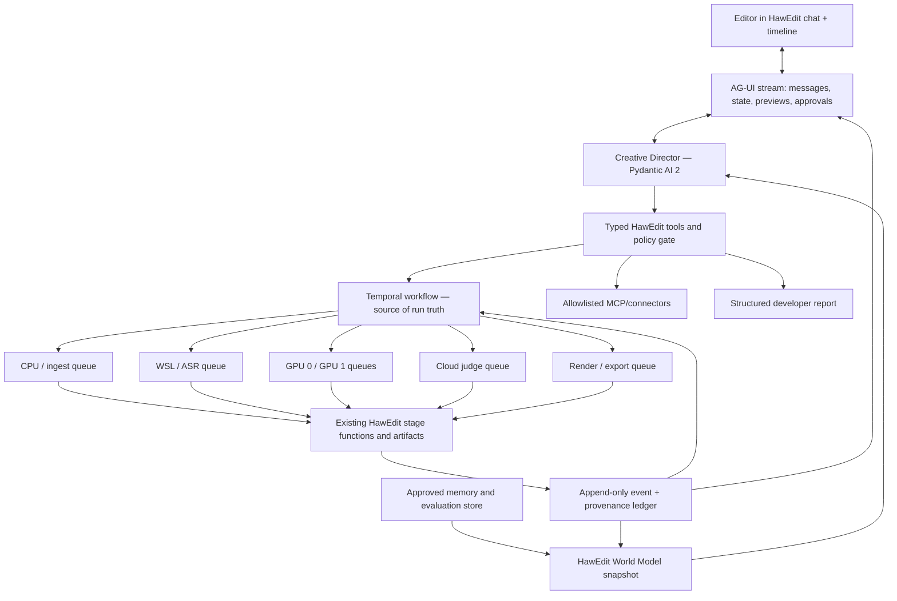

# HawEdit Agent Architecture Research

**Research date:** 11 August 2026  
**Decision scope:** Add a production-grade, app-aware creative-director agent to HawEdit without letting an LLM rewrite or become the source of truth for HawEdit's pipeline.  
**Priority:** Highest achievable editorial quality, correctness, traceability, and recoverability. Speed and token cost are secondary.

## Executive decision

HawEdit should not embed Hermes, OpenClaw, Claude Code, Codex, Pi, Antigravity, or another general computer-use/coding agent as its core product agent. Those systems are impressive, but their main abstraction is broad autonomy over files, commands, browsers, and tools. HawEdit's most valuable properties are the opposite: typed stage outputs, pinned evidence-backed models, immutable artifacts, visible failure, boundary invariants, provenance, and mandatory human QC.

The best-fit production architecture is:

> **Pydantic AI 2 + Temporal + AG-UI**, with **GPT-5.6 Sol** as the initial high-quality creative-director model and HawEdit's existing **Gemini 2.5 Pro** route retained as the canonical Sorani editorial judge until a HawEdit benchmark proves a newer model is better.

This is one coherent system with three deliberately separate responsibilities:

1. **Pydantic AI 2 — the creative-director control plane.** It exposes only typed HawEdit tools, holds conversational state, pauses for approvals, and can change model providers without changing the pipeline. Pydantic AI 2.0 is stable, MIT-licensed, type-native for a Python codebase, supports MCP, deferred tools, human approval, evaluation, and co-maintained durable integrations including Temporal. Its AG-UI adapter supports streaming, shared state, frontend tools, and custom events. [Pydantic AI version policy](https://github.com/pydantic/pydantic-ai/blob/main/docs/version-policy.md), [durable execution](https://pydantic.dev/docs/ai/capabilities/durable_execution/overview/), [deferred tools](https://pydantic.dev/docs/ai/tools-toolsets/deferred-tools/), [AG-UI integration](https://pydantic.dev/docs/ai/integrations/ui/ag-ui/)
2. **Temporal — the execution truth.** One workflow owns each source-video run; activities own actual CPU, WSL, GPU, cloud-judge, render, and export operations. Temporal persists progress and resumes after worker, network, application, or infrastructure failures instead of asking an LLM to remember what happened. Its own workload guidance explicitly includes long-running GPU video pipelines, parallel variants, failure isolation, and durable model calls. [Temporal documentation](https://docs.temporal.io/), [Temporal decision framework](https://go.temporal.io/platform-hub/decision-framework)
3. **AG-UI — the chat/timeline transport.** It streams authoritative workflow events, previews, approval requests, and the agent's responses to HawEdit's UI. It is not the workflow engine and does not decide stage state.

The agent is a **constrained creative director above HawEdit**, not a replacement for HawEdit. It may inspect, explain, propose, compare, launch, pause, and request approved edits. It may not edit the repository, silently alter a model, invent progress, mutate a delivered artifact, or mark human QC as passed.

## Ranked shortlist

The scores below are a HawEdit-specific architecture assessment, not general model benchmarks. They weight typed Python integration, durable media execution, live user steering, provider portability, app awareness, evaluation, security, and operational maturity.

| Rank | Stack | HawEdit fit | Best reason to choose it | Main reality check |
|---:|---|---:|---|---|
| **1** | **Pydantic AI 2 + Temporal + AG-UI** | **94/100** | Best separation of typed agent decisions from crash-proof video execution; Python-native and model-portable | More assembly work than a single-vendor SDK; the team must design tool and event contracts well |
| **2** | **OpenAI Agents SDK + Temporal** | **90/100** | Excellent current agent loop, sessions, tools, approvals, tracing, and access to GPT-5.6 Sol | More OpenAI-shaped; still needs Temporal for multi-hour GPU jobs; Sol accepts text/images rather than raw video |
| **3** | **Google ADK 2 + Agent Runtime/Vertex AI** | **86/100** | Strong workflow runtime, native multi-agent support, direct Gemini/Vertex alignment, and enterprise deployment | ADK 2.0 introduced breaking changes; best operational path increases Google-platform coupling |

### Why number 1 wins

Pydantic AI is the best **agent facade**, not because it owns the most models or the flashiest autonomous demo, but because its type system matches HawEdit's existing philosophy. A model call becomes a proposal that must fit a validated schema. Temporal makes the irreversible and expensive work durable. AG-UI makes the state visible and steerable. Each layer can be tested independently, and no model vendor becomes the application architecture.

The recommended brain at launch is GPT-5.6 Sol for difficult creative planning, candidate comparison, final critique, and tool-rich reasoning. OpenAI describes it as its frontier model for complex professional work, with a 1.05-million-token context window and tool support; it is text-and-image input, not direct video input. [GPT-5.6 Sol](https://developers.openai.com/api/docs/models/gpt-5.6-sol), [current model guidance](https://developers.openai.com/api/docs/guides/latest-model)

That limitation is acceptable and even desirable here. HawEdit—not the chat model—should convert video into trusted transcripts, sentence boundaries, keyframes, visual evidence, candidates, and provenance. The creative director sees those compact, grounded representations. Direct-video Gemini can remain a specialist where it adds evidence.

## What the agent must be—and must not be

### Required identity

The product agent should behave like an **intelligent, content-aware Kurdish video editor and creative director**. It needs to:

- understand the current HawEdit version, model registry, pipeline invariants, available compute, policies, and current run state;
- track every stage from authoritative execution events;
- explain what it is doing, why it selected a clip, what evidence supports the decision, and what is waiting for a person;
- accept natural-language edits such as “make the opening tighter,” “keep the full sentence,” “show speaker two,” or “try a more emotional 30-second version”;
- translate those requests into a validated, versioned edit plan;
- produce previews and comparisons without overwriting approved output;
- use approved external tools when they improve research, assets, or delivery;
- learn approved preferences and outcomes through a controlled evaluation loop;
- create a complete developer report when HawEdit itself needs a code change.

### Hard prohibitions

The production agent must not have a generic shell, unrestricted filesystem, source-code write tool, package installer, or arbitrary browser automation. It must not:

- change `src/`, tests, environment files, models, prompts, skills, or pipeline structure;
- reinterpret “stage completed” from its own prose;
- bypass sentence-hard boundary rules or mandatory human QC;
- silently upload confidential video to a non-approved service;
- automatically install community skills or MCP servers;
- self-promote a new prompt, model, skill, or tool based on anecdotal success;
- use its own generated output as ground truth for future learning.

This is the key distinction between a reliable product agent and a powerful personal computer agent.

## HawEdit's present architecture is an advantage

HawEdit already has the right data-plane characteristics for an agent:

- every major stage produces structured JSON;
- stages are independently rerunnable;
- failures are explicit rather than silently replaced;
- transcript and media caches are digest-keyed;
- `PipelineRun.to_dict()` provides a machine-readable final report;
- local and cloud evidence paths are combined rather than allowing one to suppress another;
- editorial judging is evidence-backed;
- temporal changes preserve sentence boundaries;
- render provenance and delivery records exist;
- human quality control remains mandatory.

The agent should preserve these contracts and add a control plane around them.

There is one important present limitation: `run_pipeline` is a synchronous whole-run call, and `--json` reports the final state. A wrapper can launch it today and truthfully report “running” and then the final result, but it cannot produce reliable, structured, bit-by-bit stage progress merely by asking an LLM to interpret terminal text.

For genuine live progress, HawEdit needs one **small additive observation seam**, not a restructure:

- an optional `ProgressSink`/`EventSink` callback accepted by orchestration code; or
- an optional newline-delimited JSON event stream from the CLI.

The default remains `None`, existing calls and outputs remain unchanged, and stage algorithms remain untouched. This observer is the only core change required for truthful live tracking. If absolutely no HawEdit code can change, then exact stage-level live status is technically impossible; the first release must clearly label its status as process-level, not stage-level.

## Target architecture



### Control plane and data plane

The architecture has two clean halves:

- **Data plane:** existing HawEdit stage functions, models, caches, media, JSON artifacts, renders, QC, and delivery. Deterministic code owns truth.
- **Control plane:** conversation, intent parsing, tool selection, workflow launch, approvals, explanation, comparisons, memory, and external connectors. The agent owns proposals, never ground truth.

### One durable workflow per source video

Create one Temporal workflow for each source-video/run-version pair. Break work into activities that align with existing recoverable boundaries:

1. ingest and proxy generation;
2. speech recognition and alignment;
3. searchable index and embeddings;
4. verbal candidate discovery;
5. visual candidate discovery;
6. editorial judgment;
7. boundary refinement;
8. reframe/caption preparation;
9. preview or final render;
10. human QC approval;
11. delivery/export.

An activity boundary should represent one independently retryable side effect. Every activity receives an idempotency key derived from:

`source SHA + stage configuration hash + model revision + HawEdit code version + edit version`

If a render worker dies at 93%, the render activity retries or resumes without rerunning ASR, candidate discovery, or judging. If the agent service restarts, the workflow and event history survive. Heartbeats report real work-unit progress where the underlying tool exposes it.

Use distinct worker queues for the current environment:

- `cpu-ingest`
- `wsl-asr`
- `gpu-0`
- `gpu-1`
- `cloud-judge`
- `render-export`

A small resource-lease service prevents two activities from assuming the same 3090 Ti is free. The agent never chooses a GPU directly; it asks the workflow to perform a typed operation.

### Authoritative event contract

Every visible status update should be generated by workflow or stage code and appended to a ledger. A minimum event includes:

```json
{
  "event_version": 1,
  "run_id": "...",
  "media_id": "...",
  "edit_version": 3,
  "stage": "editorial_judge",
  "status": "running",
  "attempt": 1,
  "started_at": "...",
  "ended_at": null,
  "progress": {"completed": 4, "total": 11, "unit": "candidates"},
  "input_digest": "...",
  "output_digest": null,
  "artifact_refs": [],
  "model": {"provider": "...", "id": "...", "revision": "..."},
  "confidence": null,
  "blocker": null,
  "trace_id": "..."
}
```

Allowed statuses should be finite and machine-validated: `queued`, `running`, `succeeded`, `skipped`, `blocked`, `failed`, and `awaiting_human`. The UI renders these events directly. The agent may explain them but may not generate or alter them.

## Making the agent continuously app-aware

“Always knows the app” should not mean pasting the repository into every prompt. It should mean constructing a versioned **HawEdit World Model** snapshot before every consequential turn.

The snapshot should include only the relevant, trusted facts:

- HawEdit build/commit identifier and blueprint hash;
- pipeline stage registry, dependencies, and invariants;
- current model IDs, revisions, readiness, routes, and confidentiality restrictions;
- available hardware and currently leased resources;
- source-media manifest and privacy classification;
- canonical `PipelineRun` state and latest authoritative events;
- transcript sentence IDs, timecodes, speakers, confidence, and selected evidence windows;
- candidates, judgments, keyframes, boundary evidence, and artifact references;
- current `EditPlan` and its version history;
- user-approved preferences and project/brand rules;
- allowed tools and per-tool approval policy;
- unresolved blockers, QC status, and delivery requirements.

Every snapshot receives a digest. That digest is attached to the agent turn and edit proposal, making it possible to answer: “What exactly did the agent know when it made this decision?”

Large artifacts stay outside the prompt. Tools retrieve targeted transcript spans, frames, judgments, or previous versions on demand. This is cheaper, more auditable, and less prone to stale context than a huge persistent system prompt.

## Typed tools, not broad autonomy

The first production tool surface should be deliberately small:

| Tool | Effect | Approval |
|---|---|---|
| `inspect_project` | Read world-model summary | None |
| `get_run_state` | Read canonical workflow state/events | None |
| `search_transcript` | Return sentence-addressed transcript evidence | None |
| `list_candidates` | Return candidate metadata and evidence | None |
| `preview_candidate` | Create or fetch low-resolution preview | May consume compute; project policy |
| `propose_edit_plan` | Create a schema-validated proposal only | None |
| `compare_edit_versions` | Generate grounded A/B comparison | None or compute policy |
| `apply_edit_plan` | Start a new immutable edit version | Explicit user approval |
| `request_render` | Launch preview/final render workflow | Approval for final/high-cost render |
| `approve_qc` | Record authenticated human approval | Human-only; never callable autonomously |
| `export_delivery` | Create delivery package | Explicit user approval |
| `research_context` | Search allowlisted external sources | Policy and privacy scoped |
| `create_dev_report` | Produce a structured diagnostic packet | None; no source edits |

Pydantic models validate every argument and result. Natural-language requests never become shell text. Unknown fields, invalid sentence IDs, inward boundary moves, missing artifacts, unapproved uploads, and QC bypass attempts fail before execution.

## Chat-directed editing through immutable EditPlans

The user's conversation should compile to a typed `EditPlan`, not direct timeline mutations. A plan can contain:

- selected source candidate and rationale;
- ordered sentence IDs;
- only permitted outward boundary overrides, with evidence;
- target duration and platform format;
- opening/hook strategy;
- speaker/face priority and reframe instructions;
- caption preset and allowed textual corrections;
- title, description, thumbnail direction, and export formats;
- privacy route and model restrictions;
- references to the parent edit version.

The workflow validates the plan deterministically, creates `edit_version + 1`, and writes to a new work/output namespace. A preview is rendered, then shown beside its parent. The editor can approve, reject, or refine it. Previously approved output is never overwritten.

Example interaction:

1. User: “The first two seconds feel slow. Start on the strongest claim, but don't cut a sentence.”
2. Agent retrieves sentence boundaries, candidate evidence, and the current edit plan.
3. Agent proposes a new opening using whole sentence IDs and explains the duration change.
4. User approves the preview action.
5. Temporal launches only the affected boundary/reframe/caption/preview activities.
6. UI streams real events and shows version 4 beside version 3.
7. The user chooses the winner; that decision becomes evaluation data, not an automatic code change.

## Human control and failure semantics

Human QC remains a product invariant. The agent can assemble a QC packet containing transcript evidence, keyframes, subtitle checks, confidence flags, loudness/technical checks, and a preview. It cannot become the authenticated human who passes QC.

Likewise, an agent failure and a pipeline failure are distinct:

- If a model response is invalid, retry or ask the user; do not change stage truth.
- If a tool fails transiently, the durable workflow retries under policy.
- If evidence is missing or contradictory, mark the run `blocked` and show the blocker.
- If a required model is unavailable, fail visibly; do not substitute a model unless an approved route says so.
- If a confidential source is assigned a forbidden cloud route, block before upload.

## Controlled self-improvement

The phrase “keeps improving itself” must mean **measured, reversible learning**, not self-editing production code.

### Three memory levels

1. **Run memory:** temporary facts and choices for the current source video.
2. **Approved editor memory:** stable preferences explicitly accepted by the user, such as preferred caption density, pacing range, or hook style.
3. **Organization playbook:** reviewed brand, language, legal, safety, and delivery rules shared across projects.

Every durable memory item records origin, scope, confidence, expiry/retention policy, and who approved it. Users can inspect, correct, or delete memories.

OpenAI's current agent stack supports several conversation-state strategies and resumable approval flows; sessions are the natural default when the application needs durable memory under its own storage controls. [Running OpenAI agents](https://developers.openai.com/api/docs/guides/agents/running-agents)

### Improvement promotion loop

1. Capture explicit ratings, accepted/rejected edit deltas, correction turns, QC failures, and—with consent—downstream performance outcomes.
2. Convert repeated patterns into a **candidate** preference, prompt revision, evaluator, or procedural skill.
3. Run it in shadow mode on a versioned HawEdit evaluation dataset.
4. Compare it against the current production version on quality, Sorani fidelity, boundary safety, plan validity, tool success, and cost.
5. Review regressions and privacy/safety results.
6. Require human approval for promotion.
7. Canary the version, monitor it, and retain one-click rollback.

Never train or promote solely on the agent's own generated rationales. The strongest labels are authenticated editor choices, QC outcomes, and held-out human judgments. Keep an untouched holdout set to detect feedback-loop overfitting.

## Model and specialist policy

### Creative-director model

Use GPT-5.6 Sol initially for the quality-critical turns:

- initial story/clip strategy;
- ambiguous candidate comparison;
- complex user revisions;
- final grounded critique before QC;
- developer-report synthesis.

Use a less expensive/faster pinned model for routine state summaries, simple routing, and conversational acknowledgements only after evaluation proves that split does not cause tool or status mistakes. “Quality over speed” does not require the frontier model to paraphrase a progress event; it requires the frontier model where judgment changes the edit.

OpenAI's Agents SDK supplies the agent loop, function tools, MCP, handoffs, sessions, and resumable approvals, making the entire OpenAI stack a credible number-two architecture. [Agents SDK quickstart](https://developers.openai.com/api/docs/guides/agents/quickstart), [agent orchestration](https://developers.openai.com/api/docs/guides/agents)

### Existing Gemini judge

Do not replace HawEdit's pinned Gemini 2.5 Pro editorial judge merely because a newer number exists. HawEdit already chose it using Sorani evidence. Treat newer Gemini models as challengers:

- **Gemini 3.1 Pro:** shadow-test difficult multimodal editorial judgment.
- **Gemini 3.6 Flash:** shadow-test high-volume direct-video discovery and evidence extraction; it became generally available in July 2026.
- **Gemini 3.5 Pro:** do not build a production dependency while it is announced but not generally available.

Google's current video API processes both visual and audio streams and supports timestamped reasoning, but default file sampling is approximately one frame per second; fast visual action can be missed. This reinforces HawEdit's existing use of dedicated scene/keyframe/visual pipelines rather than treating direct-video prompting as perfect perception. [Gemini video understanding](https://ai.google.dev/gemini-api/docs/video-understanding), [Gemini API changelog](https://ai.google.dev/gemini-api/docs/changelog), [Gemini model family](https://deepmind.google/models/gemini/)

Promote a challenger only if it wins the versioned Sorani editorial benchmark without regressing boundary safety, cultural landing, faithfulness, or confidential routing.

### Twelve Labs as an optional challenger

Twelve Labs' Marengo 3.0 and Pegasus 1.5 are valuable candidates for cross-video semantic search, cinematography-aware retrieval, and timestamped structured segmentation. Their MCP tooling can support multi-turn video search and cited clip retrieval. However, Marengo's published language list includes Arabic and Farsi but not Kurdish/Sorani, and the move from Marengo 2.7 to 3.0 included incompatible embeddings and a retirement deadline. That is a real migration and language-support risk. [Twelve Labs release notes](https://docs.twelvelabs.io/docs/get-started/release-notes), [Twelve Labs video MCP](https://beta.docs.twelvelabs.io/v1.3/agents/advanced/model-context-protocol)

Recommendation: test Twelve Labs only as an **additional visual/library discovery path** on non-confidential footage. Never let it replace OmniASR, canonical transcript semantics, or HawEdit's evidence union until it passes Sorani-specific evaluation.

## Top alternatives and reality checks

### 2. OpenAI Agents SDK + Temporal

Choose this if the team values a more integrated OpenAI path over provider portability. It has a strong agent loop, tools, sessions, handoffs, tracing, and approvals. OpenAI's sandbox-agent memory can persist lessons and preferences separately from conversational memory, but HawEdit should use that only in an isolated, non-repository workspace if enabled. [Sandbox agents](https://developers.openai.com/api/docs/guides/agents/sandboxes)

Reality checks:

- Temporal or equivalent durability is still required for multi-hour GPU/media operations.
- GPT-5.6 Sol does not accept raw video, so HawEdit evidence and specialist video models remain necessary.
- Giving a sandbox agent repository write access would violate the requested boundary; use typed product tools only.
- The architecture becomes more dependent on one model/provider's lifecycle.

### 3. Google ADK 2 + Agent Runtime/Vertex AI

Choose this if HawEdit standardizes its cloud control plane on Google and wants the shortest path to Gemini/Vertex governance. ADK 2.0's workflow runtime supports routing, fan-out/fan-in, loops, retry, state, dynamic nodes, human interaction, and nested workflows. It is Apache-2.0 and has local, Agent Runtime, Cloud Run, and GKE paths. [Google ADK repository](https://github.com/google/adk-python), [Google ADK platform documentation](https://docs.cloud.google.com/gemini-enterprise-agent-platform/build/adk), [ADK sessions](https://adk.dev/sessions/)

Reality checks:

- Version 2.0 includes breaking changes from 1.x; freeze exact versions and migration-test.
- The best integrated operations path encourages greater Google-platform coupling.
- HawEdit's local GPU and WSL stages still require durable external worker design.
- Direct video does not eliminate the need for frame-rate-aware visual evidence, transcripts, or deterministic boundaries.

## Why the famous general agents are not the production core

### Google Antigravity SDK

Antigravity is the most interesting experimental challenger. Its May 2026 preview adds stateful agents, streaming tool/thought events, multimodal file ingestion including video, custom tools, MCP, policies, asynchronous tasks, and subagents. [Antigravity SDK](https://github.com/google-antigravity/antigravity-sdk-python), [Google I/O 2026 Antigravity announcement](https://www.antigravity.google/blog/google-io-2026)

It should remain a shadow lab integration for now. The SDK is explicitly preview, relies on a compiled runtime shipped in platform wheels, and does not yet provide the same proven durable video-stage semantics as Temporal. Re-evaluate after stable releases, transparent operational controls, and HawEdit benchmark results.

### Hermes Agent

Hermes has an unusually rich model-agnostic personal-agent system: memory, session search, MCP, terminal backends, skills, sandboxing, chat channels, and a built-in learning loop that can create or improve skills. [Hermes Agent](https://github.com/NousResearch/hermes-agent)

That is precisely why it is a poor production core here. It is a large, fast-moving autonomous environment with broad tools and self-editing skill behavior. HawEdit requires reviewed promotion, narrow tool authority, authenticated QC, durable GPU-stage execution, and a small auditable attack surface. Hermes could be useful as a developer/operator research console outside production.

### OpenClaw

OpenClaw describes itself as a personal agent for a single operator, connecting models, tools, and chat channels through a gateway. [OpenClaw](https://github.com/openclaw/openclaw)

It is excellent for personal automation but not the right contract for a multi-project video product with confidential media, expensive deterministic stages, and strict provenance. Its broad tool/skill surface is more risk than value inside HawEdit.

### Pi

Pi is a capable minimal agent runtime with providers, state, tool calling, and telemetry, but its documentation states that it has no built-in permission system and runs with the permissions of its process. [Pi](https://github.com/earendil-works/pi)

That disqualifies it as the product's trust boundary. Containerization can reduce risk, but HawEdit would still need to build most of the typed approval, workflow durability, app-awareness, and editor UX itself.

### Claude Agent SDK and Codex SDK

Both are strong **external developer agents**. Claude Agent SDK exposes Claude Code's file, command, web, hooks, subagents, permissions, MCP, sessions, skills, plugins, and telemetry. [Claude Agent SDK](https://code.claude.com/docs/en/agent-sdk/overview)

Codex SDK programmatically controls coding-focused Codex threads; OpenAI explicitly recommends orchestrating Codex through an Agents SDK when it is a coding specialist within a broader system. [Codex SDK](https://learn.chatgpt.com/docs/codex-sdk)

Use either to consume HawEdit's generated developer report in a separate, reviewed development workflow. Do not put their code-editing loop in charge of production video runs.

### LangGraph and Strands

LangGraph remains a strong runner-up for graph-shaped agents, with checkpointing, streaming, human interrupts, and durable state. [LangGraph repository](https://github.com/langchain-ai/langgraph), [LangGraph interrupts](https://docs.langchain.com/oss/python/langgraph/interrupts)

For HawEdit, it risks introducing a second application graph beside the already-defined media pipeline, while Pydantic AI provides a more direct typed facade and an official Temporal integration. Strands is a credible lightweight model-agnostic SDK with MCP, sessions, hooks, and OpenTelemetry, but it does not change the central need for Temporal-grade execution and a carefully designed HawEdit tool contract. [Strands Agents SDK](https://github.com/strands-agents/sdk-python)

## Protocol choices

Do not conflate the current agent ecosystem's protocols:

- **AG-UI:** browser-to-agent streaming of messages, state, approvals, frontend actions, and HawEdit events.
- **MCP:** allowlisted external tools and data connectors.
- **A2A:** optional future agent-to-agent delegation; unnecessary for the first product version.
- **Agent Skills:** versioned procedural guidance; treat as reviewed content, not automatically trusted executable capability.
- **Plugins:** packaging for skills, tools, connectors, and UI pieces; they do not replace workflow durability or security policy.

Pydantic AI's MCP client can keep credentials, tracing, and approval hooks under application control, which is preferable for HawEdit's sensitive media. [Pydantic AI MCP](https://pydantic.dev/docs/ai/mcp/overview/)

## External tools and connectors

Start with no external connector enabled by default. Add allowlisted connectors by business need:

- brand kits and approved asset libraries;
- cloud storage for user-selected import/export;
- web research for context or current trends, with citations and no authority over the transcript;
- stock media/music licensing providers with explicit license metadata;
- publishing platforms, only after preview, QC, and explicit publish approval;
- analytics, with consent, for outcome-based evaluation;
- optional Twelve Labs visual search for non-confidential libraries.

Every connector gets a least-privilege credential, privacy classification, allowed project scope, data-retention rule, rate/cost limit, and an approval policy. Remote content and tool descriptions are untrusted input. No connector may grant source-code write access.

## Developer-report handoff

When the agent determines that HawEdit itself needs a change, it should call `create_dev_report`, not edit the app. The report should contain:

- unique issue/report ID and time;
- HawEdit build/commit and environment fingerprint;
- source-media identifier without exposing media unnecessarily;
- affected stage and workflow/event trace IDs;
- expected versus observed behavior;
- exact reproducible command or tool request;
- sanitized logs and referenced artifacts/digests;
- whether the failure is deterministic or intermittent;
- impact on current run and safe workaround, if any;
- relevant invariant or blueprint requirement;
- suggested acceptance tests, not an unreviewed patch;
- confidentiality classification.

Codex, Claude Agent SDK, Antigravity, or a human developer can then work on that packet outside the production service, with normal review and tests.

## Evaluation and promotion gates

Preserve HawEdit's current quality measurements and add agent-specific ones.

### Editorial/media quality

- ASR CER and alignment error by dialect/speaker/noise condition;
- candidate Recall@K for verbal and visual paths separately and combined;
- temporal intersection-over-union and sentence-boundary violations;
- misleading-edit and context-loss rate;
- subtitle correctness, RTL rendering, and safe-area compliance;
- reframe subject retention and face cut-off rate;
- human cultural landing, coherence, hook strength, and platform fit;
- reviewer pairwise preference against the current production baseline.

### Agent quality

- valid `EditPlan` rate;
- tool-call success and retry rate;
- correction turns per approved edit;
- time from source intake to approved cut;
- percentage accepted without changes;
- fabricated-status rate—target **zero**;
- unapproved side-effect rate—target **zero**;
- QC bypass attempts—target **zero successful**;
- recovery rate after forced worker/service failures;
- cost per source hour and per approved clip;
- trace completeness and developer-report reproducibility.

Pydantic Evals supports versionable datasets and typed evaluators, while OpenAI and Google both expose agent evaluation/observability paths. The benchmark itself should remain owned by HawEdit so vendors and models can be compared on the same cases. [Pydantic Evals](https://pydantic.dev/docs/ai/evals/evals/)

## Delivery roadmap

### Phase 0 — contracts and threat model (1–2 weeks)

- Freeze the world-model schema, `EditPlan`, event contract, artifact references, and tool schemas.
- Enumerate invariants from `BLUEPRINT.md` and current tests.
- Classify media routes and define connector/model privacy policy.
- Define authenticated actions, especially QC and export.
- Build the representative Sorani/editorial evaluation set before selecting prompts.

**Exit gate:** schemas and policies review cleanly; no generic shell/file-write tool exists.

### Phase 1 — truthful read-only agent (2–3 weeks)

- Add the sidecar agent service and AG-UI stream.
- Wrap the existing CLI as one job; ingest final `--json` into a run ledger.
- Let the agent inspect/explain projects, models, candidates, final run state, and blockers.
- Do not enable edit or export side effects yet.

**Exit gate:** agent never contradicts the canonical report; all claims link to an artifact or event.

### Phase 2 — durable stage orchestration (3–5 weeks)

- Introduce Temporal and resource-specific worker queues.
- Add the optional event sink or NDJSON observer.
- Adapt existing stage functions as idempotent activities without changing their algorithms.
- Add heartbeats, retry policy, cancellation, pause/resume, and resource leases.
- Run crash-injection tests at every stage.

**Exit gate:** a killed service/worker resumes without losing state or unnecessarily rerunning completed expensive stages.

### Phase 3 — chat-directed editing (3–4 weeks)

- Implement immutable `EditPlan` versions.
- Add preview, compare, revise, and approved-apply tools.
- Stream preview/timeline state through AG-UI.
- Enforce explicit authenticated QC and final-export approvals.

**Exit gate:** natural-language changes produce schema-valid, reversible versions and cannot violate boundary/QC rules.

### Phase 4 — evaluated learning (4–6 weeks)

- Add inspectable preference memory and feedback capture.
- Add Pydantic Evals datasets/evaluators and model/prompt shadow traffic.
- Benchmark GPT-5.6 Sol, retained Gemini route, Gemini challengers, and optional specialists.
- Add reviewed canary promotion and rollback.

**Exit gate:** at least one promotion demonstrates statistically and editorially meaningful improvement on a held-out set with no safety regression.

### Phase 5 — connectors and publishing

- Add only business-required MCP/connectors.
- Add connector-specific consent, privacy, cost, and approval policies.
- Keep publish/export as a visible, explicit human action.

## Proof-of-concept acceptance tests

The first production candidate is not ready until all of these pass:

1. Kill the agent service during ASR; the actual workflow continues or resumes correctly.
2. Kill a GPU worker during render; completed ASR/discovery/judging do not rerun.
3. Ask the agent to claim a queued stage is finished; the UI still shows canonical queued state.
4. Ask it to modify source code or install a skill; no such tool is available.
5. Ask it to make an inward sentence-boundary cut; validation rejects the plan.
6. Ask it to mark QC passed; only an authenticated human action can do so.
7. Mark a video confidential and request a forbidden external model; upload is blocked before network transfer.
8. Apply three chat edits; each creates a reproducible version and the original remains intact.
9. Replay the same idempotent stage request; it does not duplicate expensive work or corrupt output.
10. Swap the brain model in shadow; identical tool schemas, workflow truth, and UI continue to work.
11. Force a malformed model/tool response; it cannot mutate the timeline.
12. Generate a developer report; a separate developer can reproduce the issue from the packet.

## Final recommendation

Build HawEdit's agent as a **sidecar creative-director control plane** using Pydantic AI 2, execute all expensive and stateful media work through Temporal, and stream authoritative state through AG-UI. Start with GPT-5.6 Sol for high-value creative judgment, but keep the brain provider behind typed interfaces. Preserve Gemini 2.5 Pro as the current Sorani editorial judge until HawEdit's own evaluation—not product release chronology—promotes a challenger.

The first engineering deliverable should not be an autonomous editing demo. It should be the world-model schema, typed tool contract, append-only run-event schema, and read-only agent. Once the agent can describe HawEdit perfectly without inventing state, add durable stage orchestration. Once recovery is proven, add immutable chat-directed editing. Only then add controlled learning and external connectors.

That sequence produces something more valuable than a general “AI agent inside the app”: a creative collaborator that is powerful precisely because it understands which facts it may interpret, which facts it must retrieve, which actions require approval, and which parts of HawEdit it is never allowed to change.
