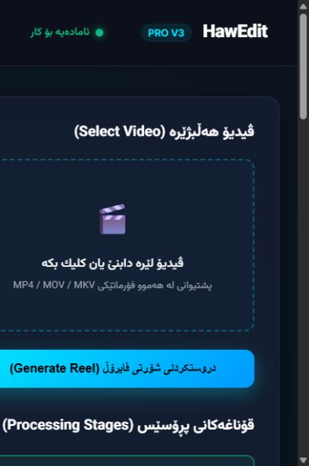
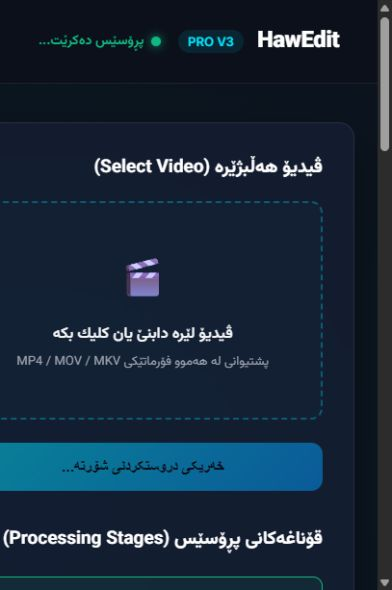
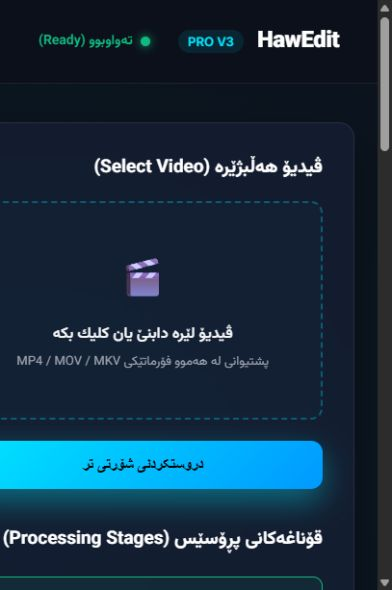
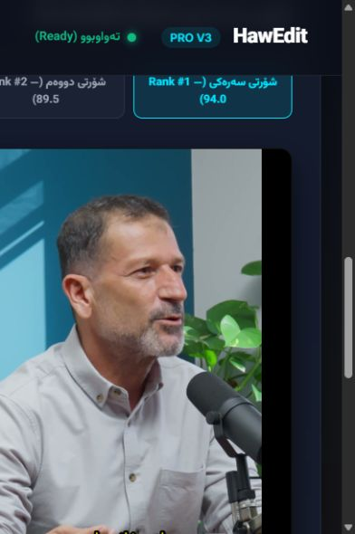
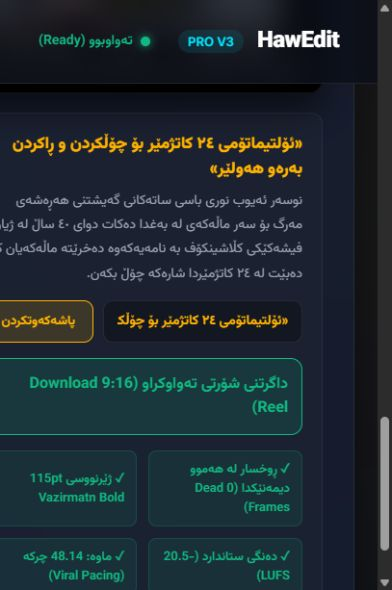
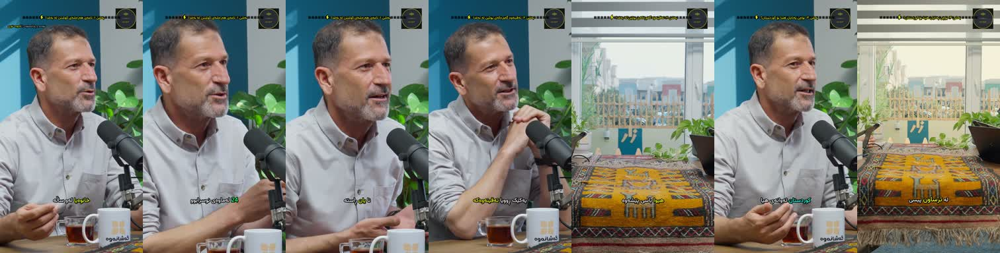
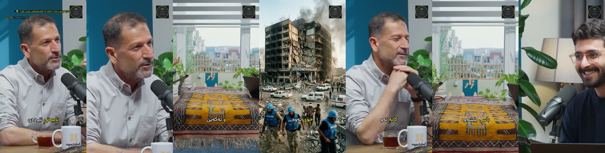
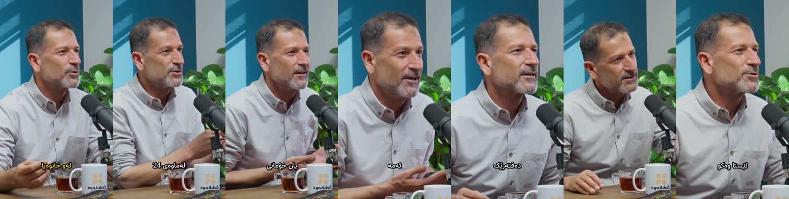

# HawEdit: creative-director audit, 9 September 2026

## Verdict

**3/10 for the autonomous creative-director outcome the owner requested.** This is an assessor's judgment, not a benchmark measurement. HawEdit has valuable speech, timing, rendering and validation components. Its current product does not demonstrate reliable independent selection, faithful story construction, professional final framing, or trustworthy final approval.

The central problem is a gap between implemented machinery and observed editorial decisions. A manually selected, specially rendered episode sample does not establish that the application can make those decisions on a new episode. Several new components validate descriptions of an edit without observing the corresponding media.

The practical target is a system that produces an excellent short from an unfamiliar Sorani interview with a clear brief, without someone secretly selecting sentence indices, writing a custom FFmpeg graph, or declaring quality in a JSON file. Music, effects, a timeline editor and more decorative controls do not address this gap.

## Scope and evidence limits

- Source commit: `7f499f53560b94c398c8c4d526e1c44e37ca4f5e`. Working tree initially clean; this audit added only its own directory to the repository. A contemporaneous report from another tool later appeared under `specs/pro-grade-program/`; it was preserved and not used to establish this audit's findings.
- Current browser flow: local `hawedit.web`, launched for this audit. Five screenshots captured and saved, then reopened and inspected. Browser viewport was narrow, approximately 390 pixels wide; desktop-width reflow was not evaluated.
- Current execution probes: real module calls against a nonexistent render path and synthetic sentence inputs. Results are in `behavior-probes.json`; the dashboard's actual job/status responses are in `dashboard-probe.json`.
- Existing delivered videos were independently reopened in this run; new frames were decoded from their actual bytes. Three exports, all from episode 29, were sampled at 2, 12, 22, 24, 34, 40 and 44 seconds. Their hashes and FFprobe results are in `media-inspection.json`. Prior quality reports are claims to examine, not independent acceptance evidence.
- Host: Windows 11 build 26200; Python 3.12.10; FFmpeg/FFprobe 8.1.1 full Gyan build. No GPU throughput or ASR accuracy measurement was performed.
- No uninterrupted audiovisual listening review, independent native-Sorani transcription review, live paid-model run, or same-footage competitor trial was performed. Still frames establish particular framing defects, not continuous motion or lip-sync quality. Transcript observations below describe the stored canonical transcript, not independently corrected speech.
- Serena tools were absent from the available tool inventory. Source and callers were traced with `rg` and direct reads. The proposed impact map needs semantic re-grounding before implementation. No application symbols were edited.
- Vault and older plans were consulted for context only. Current conclusions below come from code, probes and newly captured evidence. In particular, older claims that there is no YuNet support, no candidate tournament or no assembly implementation should not be repeated: those components now exist.

## Rating rubric

Scores describe demonstrated suitability for the requested outcome. They are approximate, not calibrated measurements, and do not represent percent completion.

| Dimension | Weight | Judgment | Reason |
|---|---:|---:|---|
| Understand the source and retain context | 25% | 4/10 | Canonical Sorani and full-transcript Gemini Path A are real; accurate episode understanding on unseen material remains unmeasured. |
| Choose a complete, worthwhile story | 20% | 3/10 | Candidate judging exists, but the condenser substitutes positional heuristics for narrative reasoning; latest assembly is manually selected. |
| Remove verbal waste without changing meaning | 20% | 3/10 | Timing/assembly tools exist; no demonstrated contextual filler/repair policy, and short inputs bypass pruning. |
| Produce purposeful, watchable pictures | 15% | 3/10 | Some close-ups work; two sampled moments of the latest reel lose the speaker entirely. |
| Verify the actual finished result | 10% | 1/10 | Missing-video critic approval reproduced; final sample reports contain unconditional pass values. |
| Run the complete workflow honestly | 10% | 1/10 | Browser progress and result selection are simulated independently of source processing. |

Weighted judgment: 2.85, rounded to **3/10**. This is a rating of the requested autonomous system, not a claim that every module deserves 3/10. Three samples from one familiar episode cannot establish general output quality.

## Captured product flow

1. **Choose source — critical.** The initial screen already shows ranked outputs and quality claims. The source control is visually clear, but Generate is enabled without a file. `web.py:486` supplies `source.mp4` when nothing is selected; line 498 sends only its name. A real media upload/registration is absent from this flow.

   

2. **Generate — critical.** Clicking Generate with no selected file changed the page into a processing state. This is not evidence of a media run. `JobManager._run_job_stages` advances a predetermined list with `time.sleep(0.04)` (`web.py:709`).

   

3. **Completion — critical.** The same no-source job reached `completed`. The API records `source.mp4`, and the page reads Ready. This should instead be a validation error. `web.py:617` also calls its in-memory job dictionary persistent, although it has no durable store.

   

4. **Review result — misleading.** A playable pre-existing reel is presented as the result. The two ranked items use the same video URL despite different titles, advertised durations and scores (`web.py:665–680`). The probe confirms equality of the two URLs. The review experience therefore cannot demonstrate two independently selected shorts.

   

5. **Second result and export — critical trust gap.** Selecting Rank 2 changes its title but retains the same downloadable MP4. Quality badges assert zero dead frames and fixed technical values; `/api/status` sets `audit_passed: true` (`web.py:826`). At this viewport, parts of the form and copy overflow the left edge.

   

The task flow needs real source intake, evidence-based progress, distinct outputs, visible editorial reasoning and exact-output approval. A timeline editor is unnecessary for that experience. Accessibility risks include clipped controls at narrow width, weak visibility of small secondary text, a drop area exposed as a container, and a headline field without a useful accessible label. Keyboard upload, focus recovery, screen-reader announcements, zoom behavior and contrast need dedicated testing; this is not a WCAG compliance assessment.

## Highest-impact findings

### F1 — The post-render critic can approve a nonexistent movie

**Critical to any release claim.** Calling `inspect_rendered_sequence(RenderedSequenceContext(render_path=missing_path, duration_ms=10000), claim_all_clear=True)` returned `is_all_clear=true`, `coverage_ratio=1.0`, zero defects; `assert_verdict_grounded()` also passed. The file did not exist.

`render_critic.py:246` generates planned windows. At line 278 it sets `has_temporal_motion=True` and estimates frame counts from duration/FPS. `inspect_rendered_sequence` never decodes the file; default source context is a Boolean. Coverage is coverage of scheduled time intervals, not coverage of inspected pixels. It can collect injected observations, but no observation producer is required. This is a reproducible function-level false approval, not a claim that the canonical pipeline currently invokes this critic.

**Required change:** separate an inspection schedule from acquired evidence. Approval must require successful decoding, measured timestamps, source/output identity, actual audiovisual observations, and explicit uninspected intervals. Missing input or unavailable perception must yield uninspected/refused, never clean.

### F2 — New intelligence modules are largely disconnected from the main execution path

`build_story_map` (`story.py:500`) wraps supplied relations; `build_shot_plan` (`shot_plan.py:320`) validates supplied shots. Those are useful contracts, but are not story inference or shot direction by themselves. Current source searches find no calls to these builders from `pipeline.py`, the web worker or the durable workflow. The same gap applies to `condense_story`, `build_episode_package`, and the post-render repair loop. Their tests prove bounded behaviors, not that the app uses them on a new source.

There is genuine existing capability: full-transcript verbal discovery in `path_a.py`, independent visual retrieval options recorded in D-271, candidate tournament selection around `pipeline.py:2260`, sentence/timing protections, assembly/render functions in `assembly.py`, optional YuNet construction in `reframe.py`, and exact-output delivery infrastructure. Preserve these and connect them through one observable production route.

### F3 — The condenser does not perform the semantic task its documentation describes

`condenser.py:203` scores opening/last position, a filler-token share, trailing conjunction membership and words per second. It does not resolve who did what, what a claim qualifies, why a sentence is necessary, or whether the ending answers the opening.

- At line 275, a source span under the maximum duration is retained without any cuts. The probe requested a 20-second target from a 40-second input and received the full 40 seconds with no pruned sentences. That is not a strict target-duration violation—the argument is described as an ideal—but it proves pruning is bypassed regardless of waste inside a short span.
- At line 333, the first and last sentences are compulsory. They need not be a hook and payoff.
- Later spans are labelled hook/conflict/climax from their order; assigning a label cannot establish a narrative relation.
- `condense_multiple_arcs` stops after collecting `max_clips` from early 80-second speech windows (`condenser.py:512`), then ranks only those. On the synthetic 1,000-second episode, requesting three clips considered selections no later than 240 seconds. It cannot find an extraordinary moment near the end through this route. This limitation does not apply to the separate full-transcript Path A.

**Required change:** discover candidates across the complete source before limiting output count. Select meaning-bearing clauses under context constraints; use deterministic timing to execute the decisions, not to invent narrative importance.

### F4 — The latest output fails both framing and thought-completion checks

Current highlights MP4: `work/ep29-highlights-master/ep29-highlights-reel.mp4`, SHA-256 `50896befea9cedc7c7ac6dcc7b79d07c1a5c0377a99a14e925582a8c671948de`. FFprobe reports 1080×1920, 25 fps and 46.080 seconds. The report rounds its planned assembly duration to 46.07 seconds; that small difference is not itself evidence of bad sync.

Fresh samples, left to right: **2, 12, 22, 24, 34, 40, 44 seconds**.

The 34s and 44s frames show table/window/background, with no speaker face. These directly contradict this file's report saying the face is centered and there are zero dead frames. Good earlier close-ups do not cancel a failed closing shot. Sampled captions and chapter labels also compete poorly with the picture at phone size; their readability needs native-language viewing at actual playback speed.

The custom producer `work/render_complete_highlights_master.py:68` selects sentences **67, 31, 71** explicitly. It is not an autonomous whole-episode selection. The resulting chronology jumps from source 1183s to 477s to 1285s. Such ordering can be valid for a clearly labelled highlights anthology; it is not automatically one causally connected story.

“Manually selected” here means fixed by an operator or external assistant in an episode-specific script. The audit does not establish whether a human or another AI originally chose the indices. It establishes that the reusable HawEdit execution path does not infer them through this script.

More concretely, sentence 31 ends in the stored transcript with **چونکە** (“because”). The next retained segment jumps to why displaced people do not return. `selected-source-context.json` records that the segmenter nevertheless calls sentence 31 complete. Sentence 30 contains the preceding introduction of the UN representative; sentence 32 contains continuation. A pause-complete segment is therefore not a meaning-complete editorial unit. No independent listening correction was available, so the finding is specifically about the retained transcript and the unsupported completeness claim.

The closing segment concerns fear and lack of trust. Labelling it simply “sanctuary” risks oversimplifying its actual point. A director must distinguish the clip's supported conclusion from an attractive label.

### F5 — Quality reports certify assumptions and presentation rules

`work/render_complete_highlights_master.py` writes literal `passed: True` values for framing, subtitles, audio sync and story. Some fields, such as loudness, are measured separately, but a measured loudness value cannot prove sync or narrative integrity. `work/render_sergio_un_master.py:314` uses the same report pattern. These artifacts do not carry independent semantic acceptance.

`check_narrative_integrity` (`sanity_gate.py:297`) checks nonempty headline/summary, duration and retained spans. The probe's generic repeated-text plan passed. It does not inspect whether a story is true, understandable or complete.

`check_face_presence` (`sanity_gate.py:213`) samples three moments per shot and uses the maximum face count. One successful sample can pass a shot with absent faces at the others. Missing Haar data returns success. A face count also cannot identify the active speaker or validate an intentional reaction shot.

Font size, outline thickness and margin are render settings, not measurements of legibility, reading order, synchronization or contextual suitability. Hard-coded “professional” standards should be replaced with perceptual checks tied to the intended output.

### F6 — Today’s stronger individual sample still does not prove general direction

The older 48-second threat reel has useful close-ups in these samples. The Sergio reel includes a building cutaway and some good speaker shots, but its 22s and 40s samples also show the table/window. The cutaway's authenticity was not verified in this audit; the file/report calling it archival is not proof of provenance.

This is evidence of recoverable craft strengths and recurring framing problems. It is not evidence that the app is better than professional editors. One familiar source, repeatedly adjusted with custom scripts, is a development example and must not be the holdout benchmark.

### F7 — Tests and completed checkboxes do not establish product acceptance

`tests/conftest.py:31` excludes `tests/media` when `HAWEDIT_MEDIA_ROOT` is unset. A zero-skip total can therefore omit the real-media tier. `specs/visual-editor-intelligence/tasks.md` simultaneously contains checked V00–V15 bullets, unchecked table rows and text saying every row is proposed. Preserve this contradiction until reconciled against evidence; do not silently rewrite history.

The canonical gate was invoked unchanged. The default Windows `bash` resolved to WSL and failed before execution because CR contaminated the derived Windows lock filename. The installed Git Bash was then used to execute the same script: lint/typecheck/format passed; pytest reported **3,670 passed, 1 failed, 3 errors**. All four non-passing cases were release-build tests refusing the untracked audit files created during this assessment. **These are audit-induced dirty-tree refusals, not demonstrated application regressions.** They do not contribute to the low editorial rating. See `verification.md` and the logs. Neither an old green gate nor a new local pass would establish editorial quality.

The GitHub check-runs request for the audited SHA returned HTTP 422, “No commit found for SHA.” Hosted acceptance of this local commit was therefore not established. No push, commit, model change or environment modification was performed.

## Three relevant comparison targets

These are three strong, directly relevant products to beat, not an evidence-backed “top three ever.” The research below is current official product documentation, not hands-on competitor output auditing. Giving them precise outcome scores while inspecting HawEdit's internals and failure cases would create a misleading comparison.

| Product | Why it belongs in the benchmark | What remains unproven here |
|---|---|---|
| OpusClip | ClipAnything documents multimodal selection using visual/audio/emotion cues and prompt-directed moment finding. This is the closest comparator for source-aware discovery. | Faithful Sorani story construction, actual selection quality and final output preference on the same sources. |
| Vizard | Documents automatic clipping; AI Edit uses speech, video and scene information for talking-head results. Its own help page says outputs vary and the feature is beta. | Whether it removes verbal waste and preserves meaning better than HawEdit; effects are irrelevant to the requested standard. |
| Klap | Its documented API exposes long-video shorts generation, reframing and exports, making it a relevant repeatable end-to-end baseline. | Whether its chosen moments are coherent and superior on Sorani, rather than merely deliverable. |

Sources consulted 2026-09-09: [OpusClip ClipAnything](https://help.opus.pro/docs/article/9947095-clip-anything), [OpusClip prompt manual](https://help.opus.pro/docs/article/clip-anything-prompt-manual), [Vizard clipping workflow](https://help.vizard.ai/en/articles/8768631-how-does-vizard-work), [Vizard AI Edit](https://help.vizard.ai/en/articles/16658532-what-is-ai-edit), [Klap API](https://docs.klap.app/), [Klap clip maker](https://klap.app/tools/ai-clip-maker).

Vendor accuracy, speed, virality and “best” claims were not adopted as measurements. No blanket claim that competitors fail Sorani is justified. Test native Sorani availability as one benchmark arm; where supported, use the same corrected transcript in a second arm to isolate editorial quality from ASR.

## What 10/10 should mean

A narrow, earned editorial standard: on unseen Sorani interviews, the output consistently has a worthwhile point, enough context, a truthful hook, an earned ending, natural clean speech, intentional pictures and comfortable captions. It remains acceptable when the source is difficult, and it refuses to manufacture a strong story from weak material.

“No filler” should mean no removable verbal waste. Preserve negation, hedging, quoted speech, corrections that change the claim, meaningful repetitions and emotional pauses. Removing every hesitation mechanically can make a serious witness sound falsely certain or emotionally unnatural.

A professional highlight can be a coherent standalone excerpt; a cutdown can assemble noncontiguous clauses while preserving their logical relations; an anthology can combine distinct self-contained moments with clear separation. Those are different editorial objectives and need different acceptance criteria.

The executable route and proposed outcome tests are in `plan.md`, `spec.md` and `impact-map.md`. No numerical score, model or test count can promise universal superiority to human editors.
