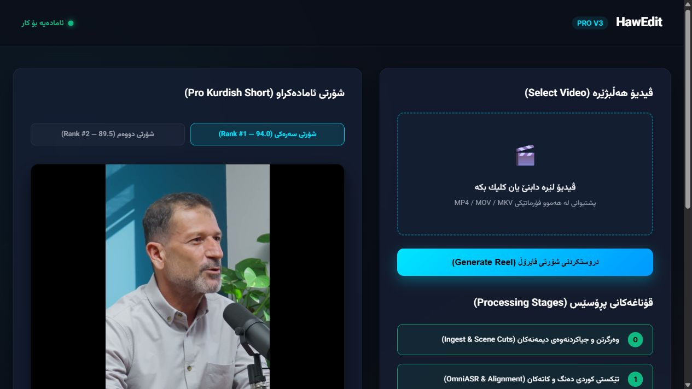
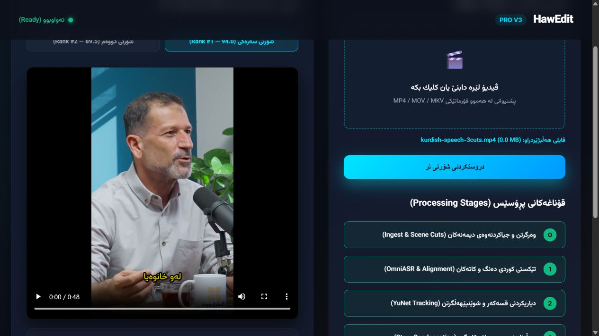
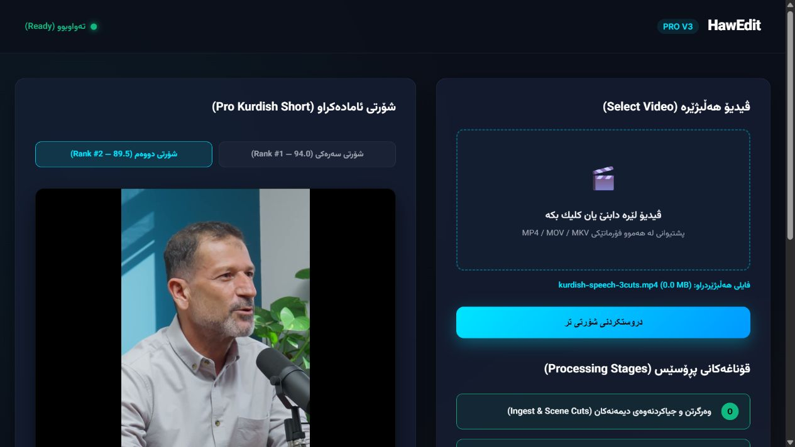

# HawEdit: deeper reliability and director audit

Date: 2026-09-09. Audited commit: `532e6efb1708e8dc2c3d14dde4fb7927f5115006`.
Baseline comparison: `7f499f53560b94c398c8c4d526e1c44e37ca4f5e`.
Scope: the actual app journey, new assembly/publication integration, inspection truthfulness, job isolation, recovery and the path to professionally watchable Sorani highlights. No app implementation changed.

## Verdict

**Production reliability: 2/10. Autonomous creative direction: 3/10.** These are engineering/product judgments, not measured benchmark scores. The stricter release-readiness score reflects reproduced false success, lost jobs, a new assembly crash and inconsistent publication state. Useful guards were fixed, but the core product promise is still unproven.

I would not call this a dependable autonomous director or endorse unattended delivery. A readable edit-plan schema, a passing unit suite and an attractive sample reel are insufficient evidence that the app can reliably understand and edit an unfamiliar source. No evidence here supports a top-three ranking or superiority to professional editors.

The main issue is integration and evidence: multiple components describe stronger guarantees than their producers and consumers enforce. Fixing isolated examples has not closed the underlying classes of failure.

## Method and limits

Fresh source inspection, real local HTTP requests, an actual browser screenshot, generated media fault fixtures, a real pipeline assembly run, and a real rendered review-bundle publication failure. No cloud model calls, paid inference, external uploads or source edits. Probe scripts and outputs are retained beside this report. The checkout was clean when the unchanged canonical gate started; audit artifacts remained outside the checkout while it ran.

Runtime: Windows 11 build 26200; Python 3.12.10; OpenCV 4.12.0; FFmpeg 8.1.1 full build; AMD Ryzen Threadripper 3990X. This host and runtime apply to all reported probe counts. The 20-job burst is one functional collision reproduction, not a throughput benchmark. Hardware details and versions are in `environment.json` and `probes.json`.

The assembly probe uses synthetic video with a supplied Sorani transcript. It verifies integration, not transcription accuracy or semantic quality. The publication probe uses the existing short speech test fixture and its supplied transcript/verdict, and publishes into an isolated audit review directory. It does not constitute a human-approved production delivery. Missing cascade testing alters only the detector-resource location in the probe process; the face-check implementation is real.

This audit does not freshly establish full-length listening quality, held-out editorial preference, GPU memory bounds, multi-hour soak behavior or competitive superiority. Browser automation initially stalled after the empty-selection alert; the supported browser API recovered the view and completed fixture selection, Generate and candidate switching. Four viewport screenshots are accepted. A malformed full-page capture was rejected and is not used as evidence. The brief timed processing transition was observed in the DOM; screenshot 3 records the resulting Ready state. Serena was unavailable; symbol and caller mapping used `rg` and direct source reads and remains provisional for implementation.

## What is actually fixed

* The render critic rejects a missing file and an explicitly mismatching expected digest. Both reproduced successfully. New code also guards empty/undecodable media.
* Empty/missing source paths receive HTTP 400. The Generate button issues a visible empty-selection alert.
* The condenser now scans windows throughout the episode and adjusts retained indices to global positions. It no longer simply stops after the first requested number of windows.
* Sentence segmentation marks listed dangling Sorani conjunction endings incomplete. This is useful lexical protection, not semantic completeness verification. A fresh counterexample remains: `چونکە…` and `چونکە۔` are marked complete, while `چونکە.` is correctly incomplete, because the stripping list omits supported terminal punctuation.
* Shot detection now has bounded windows for long media; tracking adds drift/hold behavior. These are code changes, not a measured proof of bounded memory or correct subject retention.
* Automatic music-bed discovery was removed from the examined presets, consistent with the owner's focus.

## Release blockers and major findings

### R1 — New jobs still receive demo results without real processing (P1)

**Reproduced:** POST `/api/repurpose` with the absolute path to a nonempty `.txt` file returns 201. The job then reports `completed`, `stage6_render`, 100%, and the episode-29 reels. A newly generated two-second black MP4 receives the same clips and scores. Through the actual browser, selecting `kurdish-speech-3cuts.mp4` (the approximately four-second fixture) and clicking Generate also returns Ready while showing the old 48-second episode-29 reel. `/api/status` reports `audit_passed: true`.

Code: `src/hawedit/web.py:662–739,752–819,881–900`. `_run_job_stages` checks only existence/size, sleeps through stages and sets completion. It does not invoke `run_pipeline`. Input validation fixed the empty-file symptom, not processing authenticity. Browser JS sends only `file.name`, while the server searches known local directories: arbitrary selected files are neither uploaded nor registered by immutable identity.

**Impact:** a user cannot trust that a displayed result belongs to the source they selected. No amount of editorial improvement elsewhere fixes this product path.

**Required fix:** registered asset ID + source digest, actual pipeline invocation, durable stage events, and results derived exclusively from that job's validated artifact manifest. Examples need explicit example status. Test two unrelated sources through the actual UI/API and verify provenance of each returned byte sequence.

### R2 — A two-second file earns 60 seconds of claimed inspection (P1)

**Reproduced:** a real 160×90, 25fps, two-second black MP4 with no audio is passed to `RenderedSequenceContext(duration_ms=60000)` using other defaults. The critic returns `all_clear=true`, `observed_media=true`, `coverage=1.0`, 44 observed windows ending at 60,000ms and no defects. `assert_verdict_grounded()` succeeds. The actual-duration two-second case also passes. Independent FFprobe and full OpenCV decoding confirm 2.000 seconds, 50 frames, no audio stream, and a maximum frame mean of zero (all black); see `black-media-measurement.json`.

Code: `src/hawedit/render_critic.py:149,179–199,261–326,329–480`. Generated windows invent frame counts from declared FPS. Physical inspection decodes one frame. Source context defaults to true even without a source path. Successful first-frame decoding marks the entire scheduled timeline observed; it does not verify duration, later frames, speech, subject, narrative or source fidelity. The summed 2,664 scheduled frame counts overlap and are not decoded-frame evidence.

**Impact:** the critic's strongest success claim is not grounded. Fixing missing media has not fixed unsupported all-clear.

**Required fix:** separate planned inspection from observations. Default every evidence state to unknown. Probe real metadata, decode required intervals, inspect rendered speech/audio and aligned source context, record actual timestamps/frame IDs and bind observations to exact source/output/plan digests. Unobserved coverage must block quality approval. Technical decoding and editorial judgment must remain distinct.

### R3 — `assemble=True` crashes in the real pipeline (P1, new integration defect)

**Reproduced:** source intervals 10–11s and 30–31s, three complete supplied Sorani sentences, selection `(0,2)`, `assemble=True`, `min_clip_ms=1000`. `run_pipeline` raises `StopIteration` at line 2549 via `_raw_text_for_words` line 1445.

Code: `src/hawedit/pipeline.py:1368–1417,1432–1447,2378–2482,2548–2549,3115`; `src/hawedit/assembly.py:89–165`. `_prepare_selection` creates new Word objects on an output timeline, returns anchors `(0,2000)` and discards the assembled source-span mapping. `_raw_text_for_words` later searches the original transcript using object identity. Beyond the crash, boundary fusion, source context and `render_clip` still consume the original source clock. The standalone assembly renderer is not wired into this branch.

The added test at `tests/test_pipeline.py:7018` tests `_prepare_selection` alone. It does not continue the returned values through the pipeline or inspect rendered pixels/audio.

**Required fix:** carry immutable source word IDs and an explicit ordered source-to-output map through judging, boundary decisions, audio/video assembly, captions and delivery. Do not repair only the `StopIteration`; that could expose a wrong-footage render. Test distant intervals with visibly and audibly distinguishable content and verify every output join.

### R4 — Edit-plan writes break the atomic publication contract (P1, new integration defect)

**Reproduced:** an isolated directory occupies the intended `.edit_plan.json` pathname, causing a real permission/write error. The pipeline first publishes the six-file review bundle, then fails writing the plan. It reports `render completed privately but was not published`, while the MP4, ASS, SRT, EDL, JSON and measurement file exist in the published review directory.

Code: `src/hawedit/pipeline.py:3241–3301,3302–3333`; `src/hawedit/artifact_bundle.py:237–266`. `discard()` correctly cannot remove an already renamed staging directory. The new promotion code has the same ordering problem: `src/hawedit/delivery.py:873–884` publishes before copying optional plan files. The review pipeline writes its plan to `work_dir/<clip>.edit_plan.json`, while promotion searches inside the candidate review directory. A returned plan pathname is not proof that the plan exists or belongs to the candidate.

**Impact:** interrupted/failed work can leave externally visible artifacts inconsistent with reported state; promotion may omit the plan. A professional edit plan is not yet a mandatory atomic part of the product.

**Required fix:** build and validate the entire authoritative plan and delivery set before one publication commit. Include plan identity in the manifest and derive outputs from it. The reported state must match disk state after errors/restarts. Add failpoints before and after each write/rename, and verify recovery plus retry behavior. Respect D-263's existing bundle guarantees when extending its schema.

### R5 — Job IDs collide and job state is not durable (P1)

**Reproduced:** 20 sequential calls to `JobManager.submit_job` in a short burst returned six unique IDs and left six stored jobs. No clock mocking or concurrent callers were used. IDs are millisecond timestamps; `_jobs[job_id] = job` overwrites earlier entries. Multiple background workers can then address the same surviving job. A fresh manager contains no records.

Code: `src/hawedit/web.py:628–642,662–701`. The lock protects operations, not ID uniqueness. The docstring says persistent, but storage is a process-local dictionary.

**Required fix:** durable unique job IDs; distinct idempotency keys; transactional queue/claim/lease; bounded worker concurrency; persisted terminal states and manifests. A retried request should recover its existing job, while distinct requests must never collide. Test rapid submissions, restart after acceptance, worker termination, duplicate delivery and expired leases. Do not assert a total cloud-billing exactly-once guarantee unless the provider supports it; record ambiguous external calls for reconciliation.

### R6 — Recovery reuses corrupt intermediate media (P1)

**Reproduced:** after a successful ingest, replaced only the isolated audit proxy with 21 bytes of text. The next run emitted `resumed from checkpoint`, returned that proxy path as ingested media and left the corrupt bytes untouched.

Code: `src/hawedit/pipeline.py:1810–1837`; `src/hawedit/checkpoint.py:81–105`. Resume matches a source hash and checks that audio/proxy paths are files. It does not validate output hashes, sizes, decoder metadata or producing configuration/version. Corruption is not detected at the reuse boundary; downstream consumers may later fail.

**Required fix:** checkpoint dependency manifests bind inputs, effective configuration, model/code versions and every required output digest. Validate before reuse and invalidate downstream dependants when any dependency changes. Distinguish “not run,” “valid cached result,” “corrupt result” and “external outcome uncertain.” Test truncation, replacement, missing sidecars, config/model drift and interrupted writes.

### R7 — Face inspection still passes when it cannot inspect (P1 for quality certification)

**Reproduced:** black video with an empty shot schedule returns `(True, {}, ())`. Pointing only the cascade resource path to a nonexistent audit directory also returns success. A normal `(0,2)` shot on the same black video correctly fails, so the negative control works.

Code: `src/hawedit/sanity_gate.py`, `check_face_presence`, especially the missing-cascade `return True` and three-point sample loop. Three points cannot substantiate “0 Dead Frames.” Holding a previous crop is not evidence that the intended speaker remains there.

**Required fix:** unknown/unavailable measurements must never become a pass. Use source shot coverage and expected-subject tracking with calibrated detectors; track missing-subject duration and worst contiguous loss. Intentional cutaways require sourced classifications. Keep detector uncertainty separate from editorial appropriateness.

### R8 — Error and result handling remains brittle (P2)

**Reproduced:** valid JSON array `[]` causes `RemoteDisconnected`, not a structured validation response. Rank-two media URL returns 404. In the browser, selecting rank two changes the player source and headline but leaves Download pointing to rank one; the screenshot alone shows a retained poster, while the HTTP 404 proves the unavailable media. Code inspection shows `pollJob` handles only `completed`, silently ignores HTTP errors and catches network failures without terminal recovery; failed/missing jobs can leave the UI indefinitely waiting. `/api/status` can label a failed latest job busy.

Code: `src/hawedit/web.py:524–544,753–759,887,905–926`.

**Required fix:** typed bounded request schemas; explicit failed/cancelled/needs-review/expired states; terminal handling and retry affordance; job-relative URLs that are validated against a manifest. Test malformed JSON types, media disappearance, server restart, failed worker, nonexistent job and playable candidate two.

### R9 — The director still lacks a demonstrated end-to-end reasoning loop (P1 product capability gap)

Current caller searches find `inspect_rendered_sequence` in the repair helper, not the pipeline; `build_story_map` and `condense_multiple_arcs` are not pipeline consumers. VisualEditPlan is constructed after rendering/publication rather than directing it. The condenser still labels position/duration heuristics as measured virality and can return overlapping source sentences despite promising distinct non-overlapping arcs. In the synthetic fresh probe, returned candidate two and three both retained sentence 7.

Credit the existing full-transcript discovery and judge paths: the system is not merely a keyword selector. But the newly changed route does not establish that understanding, paper editing, assembly, rendered critique and repair are connected and tested as one behavior.

**Required fix:** an authoritative pre-render edit plan must explain the central point, audience question, necessary setup, exact evidence, payoff, retained speech, removed material and causal/context dependencies. Evaluate alternative paper edits, enforce fidelity, render the selected plan and judge the actual output against source. “Filler removal” must preserve negations, qualifiers, meaningful hesitation and emotional timing. A word list cannot decide this.

## Fresh product flow evidence

1. **Open app — poor trust state.** The source selector and main action are clear, with a recognizable Sorani interface. Sample reels, fixed ranking scores and success claims are already present before a source is selected. Screenshot 1 is the initial viewport. Keyboard/accessibility compliance is not established.
2. **Select/validate input — partially fixed.** Generate without a file issued the expected alert and an inline error. Screenshot 2 captures the recovered validation state. The API rejects missing paths but accepts non-media bytes. Browser file selection was then exercised with the existing short fixture. General upload/registration remains absent.

3. **Process source — failing.** Browser selection of the approximately four-second fixture followed by Generate produced Ready with the old 48-second reel. Screenshot 3 shows the selected fixture, Ready state and old video. HTTP probes and source tracing establish that the stages are simulated.

4. **Review/download candidates — failing.** Screenshot 4 shows rank two selected with the same poster. The final DOM records a changed player source but unchanged rank-one Download link. The rank-two endpoint independently returns HTTP 404. No fresh autonomous output's watchability is established.

## Verification

The full canonical gate result is recorded in `verification.md`. GitHub's exact-SHA checks request returned HTTP 422, “No commit found”; hosted CI for this SHA is not established. `tests/media` is excluded from collection when `HAWEDIT_MEDIA_ROOT` is unset, so ordinary suite success must not be relabeled a held-out real-media benchmark.

## Priority decision

Do the three work packages in `plan.md` in order: (1) truthful and durable execution, (2) one source-bound plan and atomic delivery, (3) measured creative direction and independent output inspection. Passing the present tests while leaving these integration probes red would not improve release readiness.
