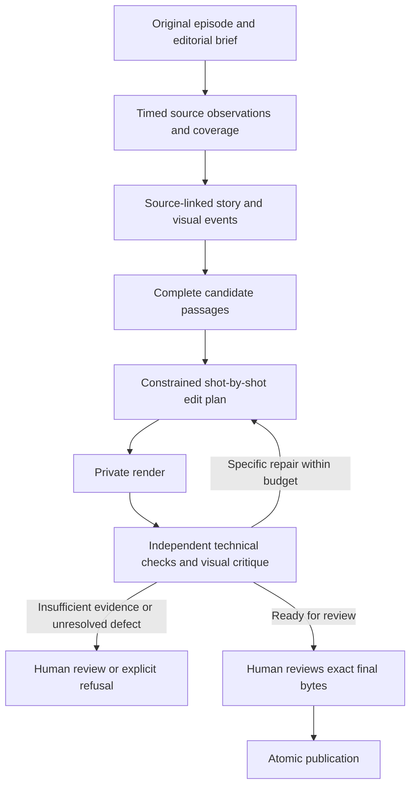

# Visual-first plan — HawEdit as a dependable editorial system

Date: 2026-09-06. Source snapshot: `b134305847936f59c8c88490cfeffe24f66f2236`.

Approved-by: pending for new visual-intelligence extensions; existing authorization in `../reliable-content-aware-pipeline/plan.md` is preserved.

This is a proposed extension and reprioritization based on the owner's request for visual/content-aware intelligence and robustness. It does not reset accepted work, revoke prior approvals or mark unverified ledger rows complete. [Research and current rating](research.md) explain the evidence. The original reliability program remains the base implementation plan.

## Product promise and honest scope

HawEdit should watch the available source evidence, understand the passage, make restrained visual decisions, inspect its rendered work and return a small set of faithful, visually strong clips ready for human approval. It should know when it lacks evidence and when preserving the original shot is the best edit.

Start by earning leadership for **Sorani interviews, podcasts and news discussion** on the current deployment. “Number one in every kind of video” requires separate validated support for demonstrations, screen recordings, documentary material, sports, gaming and other domains. Success on one podcast cannot establish that claim. Expand by measured domain acceptance after the first domain works.

Keep existing models, source-canonical text, Python, FFmpeg, DBOS/SQLite and model lifecycle controls. Music generation, sound effects, automatic B-roll and decorative animation are outside this critical path. Sound work is limited to intelligible source speech, synchronization, avoiding clipping and the existing delivery contract; listening remains necessary to judge meaning and pauses.

## What “always sees the vision” should mean

Every edit decision must have sufficient source evidence and a stated editorial purpose. Every part of the final timeline must receive appropriate quality checks. The system may not claim it observed an event simply because it embedded a window, generated fluent prose or saw nearby stills.

This does not require sending every frame to a large model. Use inexpensive whole-episode scanning, cached observations, event-triggered close inspection and bounded temporal windows. Record where the view is sparse or missing. A quiet static statement may be the strongest moment; visual motion must never become the sole importance filter.

Model roles stay recognizable: OmniASR/CTC establish canonical timed speech; the validator handles justified uncertainty; existing retrieval and VideoChat3 supply visual evidence; Gemini judges source-grounded editorial choices; TimeLens supplies relevant intervals; deterministic code enforces clocks, budgets, transformations and publication. A model recommendation cannot override a hard constraint or approve publication.

## The editing-team workflow

These are functions of one system, not a proposal to add a fleet of agents or services.

| Editorial function | Question it answers | Durable evidence |
|---|---|---|
| Assistant editor | What footage exists, and where is it usable? | Source manifest, scene list, timebases, decode gaps, transcript/alignment coverage. |
| Researcher/story editor | What is happening and what does this passage mean? | Canonical question/answer/caveat references, topic and event spans, explicit uncertainties. |
| Picture editor | Which view best communicates this moment? | Shot-by-shot keep/crop/layout decisions tied to people, objects and source timestamps. |
| Finishing editor | Does the actual result read clearly and flow? | Final-video visual observations, caption checks, temporal continuity findings. |
| Quality reviewer | Is it faithful, technically sound and approved? | Independent checks, unresolved defects and human approval of exact final bytes. |

## Proposed data flow

## Ordered work units

Each V unit below has an observable exit condition and proposed tests in [spec.md](spec.md). Start with V00, then proceed sequentially. The existing T-series references are reuse/mapping instructions, not evidence of completion.

### V00 — close the remaining false-success paths

Reuse T01–T04 and assess their actual call paths rather than rerunning a checkbox checklist. Missing OpenCV or any required measurement dependency must return an explicit unavailable result and block a dependent success claim. Wire caption text/glyph/geometry checks into canonical rendering, revision rendering and candidate promotion, with actual expected source text. A helper existing in tests is insufficient.

Revalidate final file identity and the approved manifest during promotion. Bind all delivered media/sidecars, source bytes, edit-plan version, effective configuration and evidence version. Freshly recompute inexpensive checks; expensive immutable measurements may be reused only with a validated binding and explicit trust model. Do not trust editable measurement JSON merely because it repeats the MP4 hash.

Exit: controlled missing-dependency and altered-caption/sidecar cases cannot result in valid public delivery. The current commit's required CI evidence must be established before claiming this unit accepted.

### V01 — establish one source clock and one edit contract

Reuse T05–T06. Resolve options once, then build a versioned immutable plan from canonical source intervals. Track source time, clip time, output time and actual decoded frame timestamps distinctly. Derive ASS, SRT, EDL/OTIO, scene/crop events and review markers from that mapping.

Include the intended viewer takeaway, content type, duration range and protected content in a short editorial brief. Use conservative defaults when unspecified and show the resolved brief in the report. Apply it consistently during selection, framing and final review.

Exit: a plan can be replayed and inspected without guessing timestamps, default precedence or which bytes a review approved.

### V02 — inventory the entire episode's visual evidence

Extend existing ingest/window/frame artifacts to record all source intervals and what observation covers each interval. Use scene cuts, motion/change summaries, decoded frame identity, visible people/objects/text regions where supported, VAD and timed speech. Separate “scanned,” “sampled,” “model inspected” and “unknown.” Cheap scan coverage does not mean semantic understanding of every frame.

Preserve independent verbal discovery. Add no-motion speaking scenes, long static shots and source tail intervals to coverage tests; do not discard them for low visual novelty. Store compact source-bound JSON in existing artifact storage rather than add a graph database.

Exit: there is a reproducible answer to what HawEdit actually saw and where it might have missed evidence.

### V03 — inspect uncertain visual events more closely

Plan denser observation around shot changes, speaker transitions, object demonstrations, brief reactions, screen changes and uncertain composition. Retain background coverage on uneventful stretches. The selection policy must not depend only on speech keywords or the candidate already winning.

Use the same supported models and cache exact frame IDs/timestamps. Respect the configured per-window/frame/pixel/VRAM budget and installed processor requirements; measure on the actual hardware before changing any ceiling. Stream bounded windows sequentially. A changed extraction/survivor policy needs an ADR against BLUEPRINT §3 and relevant frame-budget decisions; never quietly increase limits or pad missing frames.

Exit: annotated brief events missed by uniform still sampling are recovered within the locked resource budget, or marked unobserved. Measure event recall and review cost, not just the number of frames processed.

### V04 — distinguish people, speakers, listeners and off-screen speech

Reuse T10 and current diarization/tracker interfaces. Maintain scene-local face/subject tracks with uncertainty; re-establish identity across cuts using actual evidence rather than remembered screen coordinates. A single visible face is not sufficient to associate that person with the voice. Mouth motion can support association but must account for head/camera motion and detection failure.

Represent listener/reaction and off-screen states explicitly. A useful listener shot may stay visible, but it cannot be labelled as the speaker. Observe expressions/actions without treating guessed emotions or intentions as facts. Unresolved identity leads to neutral framing or review.

Exit: listener close-ups, profile faces, pans, camera cuts, occlusion and overlapping speech receive honest labels and acceptable framing. A new active-speaker model is considered only if measured failure of the existing approach justifies a licensed, approved change.

### V05 — connect story meaning to visual events

Reuse T08–T09 and existing judge contracts. Build an episode-level map of canonical passages and their relations: question/answer, setup/payoff, claim/qualification, earlier/later correction, demonstration/explanation and visible reaction. Every relation cites actual sentence/frame/event IDs and carries uncertainty.

Do not replace the source with a summary. Summaries are navigation aids; final selection and judgment return to exact canonical words and source footage. Keep caption text, translation, editorial description and source assertion separate. Quoting a speaker's claim is not independent factual verification.

Exit: the judge can explain why the complete passage matters using traceable evidence and can identify context that must remain.

### V06 — select complete, worthwhile passages

Candidate discovery should propose a full setup, substantive point and landing beat, while retaining valid short standalone statements. Check pronouns, questions, negation, attribution, qualifications, sarcasm ambiguity and later corrections. Expand to the necessary complete sentences or reject; do not invent a hook to cover missing context.

Rank only eligible candidates using one policy across single and batch modes. Human-calibrate the trade-off between clarity, significance, payoff and duration. Repeated judges agreeing is not independent proof. Compare a small number of genuine alternatives only when it resolves uncertainty within budget; no unbounded search for a high score.

Exit: an unseen context-dependent excerpt is not passed because it sounds dramatic, and quiet but substantive passages remain discoverable.

### V07 — write a shot-by-shot visual plan before rendering

For every output interval record the source interval, focal subject/content, reason for that focus, allowed crop/layout, protected regions, caption region, transition and supporting evidence. Distinguish “keep source shot,” “crop,” “hold,” “follow,” “existing two-person layout” and “needs review.” Never choose a transition merely because a cadence timer elapsed.

Prioritize the content's visual subject: an object being demonstrated or a chart being explained can matter more than a face. If no crop can preserve necessary content, retain the source view in an appropriate existing layout or refuse the requested composition. The system cannot invent an unavailable camera angle.

Exit: a reviewer can trace each visual decision to a passage and source observation; unsupported camera plans are rejected before encode.

### V08 — optimize composition across whole shots

Reuse T11 and the existing crop/layout helpers. Account for headroom, eyeline/look room, meaningful gestures, protected objects/text, source resolution and caption area. Choose stable framing for stationary content; choose smooth movement only when it preserves relevant content. Add hysteresis and confidence-aware holding rather than react to every detector box.

Measure crop motion, subject cutoffs, required-region visibility and abrupt scale jumps over the sequence. A listener reaction may deserve a cutaway; the system must preserve its true time relationship. An answer at minute ten cannot be paired with a dramatic reaction from minute forty and presented as contemporaneous.

Exit: meaningful visual content stays visible without restless crop motion; composition quality holds across opening, middle, transitions and ending.

### V09 — preserve continuity and meaningful pauses

Reuse T07 and the shared time mapping. Trim only justified dead space after checking speech, alignment uncertainty, gestures, reactions and turn-taking. Keep breaths or silence that make the point land. Preserve complete word boundaries and synchronize edits across video/audio/captions.

Protect action continuity, speaker turns and causal ordering. Evaluate the transition as a sequence, not two unrelated stills. Default to chronological contiguous passage editing. Noncontiguous assembly remains a later, separately accepted mode with explicit source provenance and meaning review; existing assembly helpers do not justify enabling it.

Exit: the rendered edit retains the intended event order, readable action and complete idea without fabricated reactions or speech truncation.

### V10 — make captions support the picture

Reuse T12 and current shaping/verification. Set a restrained owner-approved style with measured rendered width/height, safe positioning and adequate reading exposure. Protect Sorani grapheme joining, names and mixed-language text. Avoid covering faces, demonstrating hands, charts or existing source captions; select another approved region when possible.

Do not solve overflow by silently shrinking text to unreadability or paraphrasing canonical speech. Adjust phrase grouping/timing within the allowed speech mapping, or escalate. Test on the final compressed video at actual phone presentation sizes. Keep source sound clear and in sync; music/effects are not part of this unit.

Exit: captions remain readable across bright/dark/busy scenes and rapid speech, without changing source text or hiding important visuals.

### V11 — watch and critique the rendered result

This is the largest missing editorial capability. Add a bounded final-video inspection using the existing visual/judge adapters where supported. Supply the rendered sequence and aligned original context, not merely the plan or source-only keyframes. Cover the entire output with overlapping temporal windows; inspect transitions, first/last frames and difficult regions more densely. Do not claim motion was judged from isolated stills.

Ask specific questions: Does the shot show the relevant content? Is a listener misidentified? Does the cut remove necessary setup or change the reaction's meaning? Are hands/chart/text lost? Do captions obscure the point? Does the ending land? Can the viewer follow the clip without the episode?

Require structured defect records with output timestamp, severity, observation, source reference, permitted repair and confidence. Deterministic technical checks remain separate. A fluent VLM critique can be wrong, and the same model used for generation is not an independent final quality authority. Validate defect detection against human-labelled intentionally damaged renders.

Exit: the critic finds known visual/content defects in actual MP4s and reports unknown evidence instead of certifying it.

### V12 — repair specific defects, with a strict stop rule

Reuse existing revision/proposal tools. Allowed repairs include changing a crop, holding a source shot, moving/regrouping captions or expanding to complete context. No changing canonical speech, fabricated footage, threshold weakening or automatic human approval. Changes must satisfy the shared plan and invalidate earlier review.

Proposed initial limit: two repair iterations per candidate, within an owner-approved cumulative compute/cloud budget. Stop earlier when no validated improvement occurs or a repair oscillates between states. Preserve the best valid candidate and full defect history; escalate unresolved critical defects. A lower self-score alone is not proof of improvement.

Exit: injected correctable defects are repaired without new protected-content failures; unfixable cases stop predictably. Full render validation repeats on the final candidate.

### V13 — deliver a useful episode package

Reuse T14 and `episode.select_episode_plan`. Share ingest/transcription/indexing once, then render up to N distinct eligible clips. Measure semantic duplication, not only temporal overlap or lexical Jaccard. Keep genuinely different perspectives on the same topic when justified.

An episode report should show what was selected, why it is distinct, what was rejected and what still needs review. Do not force N outputs. Apply the same final-video critique and exact-byte approval to every clip and every revision.

Exit: batch output is a coherent set of useful clips with honest individual states and no duplicate weak fillers.

### V14 — prove recovery and controlled evolution

Reuse T15–T18. Retain coarse DBOS/SQLite unless a measured recovery gap requires a narrowly scoped change. Version contracts, evidence, workflow behavior and cache identities. Test restart around inference results, artifact writes, final critique, repair, review and publication. A billed request with unknown outcome needs explicit reconciliation/bounded policy, not blind retries or an exactly-once claim.

Validate disk capacity, model/runtime readiness and GPU lease before work. Clean up exact owned resources and preserve primary errors. On this Windows host never use Ctrl+C through a Codex terminal or detached `Start-Process` verification; fault tests target only a verified child process.

Keep code maintainable through typed state/contract boundaries, pure policy functions and narrow adapters. Use one source of ranking, one timeline map and one promotion gate. Add meaningful generated-edge-case/property tests for interval math and state transitions using existing test tools where possible. Refactor only touched seams; do not introduce microservices or broad abstraction rewrites.

Pin model/dependency versions; shadow-test updates on frozen and fresh Sorani cases with rollback. Current model names are preserved until measured evidence and required approval justify change. Future readiness comes from replaceable tested boundaries, not continually switching to the newest model.

Exit: all supported fault scenarios produce recovery or explicit safe failure, accepted artifacts remain immutable, and the candidate release passes required current checks.

### V15 — prove the rating with real editors and competitors

Reuse T19–T20 and existing corpus/editorial/diarization kits. Before tuning, label a development set and separate unseen holdout by episode/program/speaker. The owner and Kurdish editor define required context, important visual regions, acceptable alternatives and critical errors. Multiple valid edits are allowed; avoid treating one exact crop sequence as the only correct answer.

Run two matched evaluations: full episode-to-clips, and finishing of identical source spans. Compare HawEdit, OpusClip, Klap and Submagic with recorded versions/settings and equal manual correction allowance. Also compare with a commissioned Kurdish editor. Account for unsupported languages separately; count refusals and correction labor honestly. Obtain authorization before paid jobs or uploading private footage to a competitor.

Measure critical meaning errors, useful moment recall, visual event recall, speaker-attribution errors, protected-content visibility, continuity failures, caption defects, first-pass publishability, human correction time and blind preference. Include cost/latency but weight them after fidelity and quality. Use cluster-aware confidence intervals, not clip-count pseudo-replication.

Exit: the accepted scorecard is met on unseen episodes, exact-SHA local/media/hosted checks are green and the owner/editor sign off. A second fresh holdout and representative use period substantiate sustained quality. No implementation task or model may independently declare the whole product “number one.”

## Test suite that actually challenges an editor

Build labelled examples from authorized real source material covering all these cases. Every case has an acceptable outcome set, not merely a golden answer from the current renderer.

| Challenge | Required editorial behavior |
|---|---|
| Dramatic sentence followed by a qualification | Retain qualification or refuse the excerpt. |
| “Yes/no” answer whose question changes its meaning | Preserve the question/context. |
| Sole visible person is listening | Do not attribute off-screen speech to the visible face. |
| Quiet static shot contains the strongest idea | Preserve verbal discovery despite low visual motion. |
| Brief gesture/reaction between uniform sample times | Targeted temporal inspection finds it or marks evidence insufficient. |
| Two faces exchange turns or overlap | Stable, honest attribution and layout; no nervous crop switching. |
| Chart/object/hand demonstration is essential | Preserve it even if face-centered cropping would look larger. |
| Existing source subtitles/nameplates | Avoid duplicate overlap and preserve required identification. |
| Wide shot cannot survive a narrow crop | Choose an acceptable source-preserving layout or refuse. |
| Scene cut changes seating/screen positions | Reset/re-establish tracks; do not reuse stale coordinates. |
| Long pause carries hesitation or emotional meaning | Keep it unless evidence supports a safe trim. |
| Reaction from another time would make the clip more dramatic | Refuse misleading temporal reassignment. |
| Fast Sorani with names, numbers and code-switching | Correct source text, joining, reading exposure and timing. |
| End of clip contains the payoff or final correction | Finish the complete beat; no arbitrary duration truncation. |
| Render succeeds but visual layout is poor | Critic reports timestamped defect; bounded repair or review follows. |
| Verifier dependency fails or sidecar changes after review | No fabricated passing metric and no valid publication. |

## The scorecard and the meaning of 10/10

Retain the original plan's proposed reliability, fidelity and first-pass goals, subject to the locked protocol. Add visual-editor evaluation rather than invent an average that lets strong captions compensate for misleading content.

| Area | Proposed acceptance target, not a measured result |
|---|---|
| Critical fidelity | Zero observed critical misrepresentation/false-attribution/word-cut errors in released holdout clips; report a confidence bound and insufficient sample size honestly. |
| First-pass output | At least 95% publishable without corrective editing; lower confidence bound and per-condition outcomes reported. |
| Visual relevance | At least 98% of labelled required-content time preserved in an acceptable composition; listener/neutral views classified separately from speaker-tracked time. |
| Event coverage | At least 90% recall on labelled brief important events; report misses and observation gaps, including quiet/no-motion content. |
| Render critic | Proposed pilot target: at least 95% recall of seeded critical visual/content defects and no more than 10% false alarms on clean cases; human-labelled natural defects required before generalizing. |
| Repair quality | Critical defects never auto-approved; repairs cannot regress protected meaning/content. Report useful-repair rate, new-defect rate and budget exhaustion. |
| Technical reliability | Original proposed 99% lower one-sided 95% success bound on eligible jobs; policy refusal and technical failure reported separately. No silent invalid publication in fault drills. |
| Blind preference | At least 60% preference and a lower 95% interval above 50% against each supported competitor configuration, with episode clustering and multiple-comparison handling. |
| Editor-grade quality | Pre-registered non-inferiority to a Kurdish editor, plus materially lower correction effort under a fair protocol. Superiority needs stronger separate evidence. |

Lock targets after a development pilot, before holdout evaluation. Percentages above are proposed engineering/product requirements, not scientific laws or facts about existing performance. For a critical failure-rate claim below 1%, a handful of clips cannot provide adequate evidence; use the original plan's sample-size/cluster caveats and a preregistered analysis. Hard release blockers remain hard blockers regardless of averages.

I would consider 9.5 only after this bounded workflow wins on fresh, representative Sorani material and required CI. I would consider 10 after it sustains that standard on another unseen set, real-use cases, fault recovery and a verified rollback. Broader content types must earn their own evidence before an all-video leadership claim.

## Implementation discipline and next action

Use [impact-map.md](impact-map.md) and [spec.md](spec.md). Re-ground symbols/references with Serena before code changes; the tool was unavailable during this scoped document audit. Preserve AGENTS.md gates and frozen BLUEPRINT. New data contracts, observation policies, post-render judging or agent repair authority require an ADR and the relevant approval; do not silently bypass existing agent rules. The exact canonical command remains `bash scripts/verify.sh`. Enforcement changes require `.codystem-allow-self-edit`, and only the ledger tool may mark tasks after qualifying evidence plus required hosted CI.

Do not interrupt or duplicate another task's implementation. Fold the mapped reliability work into its existing approved units. The first practical milestone is **V00 plus one challenging real source clip**: make the checks honest, then carry that clip through source observation, visual plan, final inspection and a recorded repair. Expand only after that vertical slice is observable end to end.
